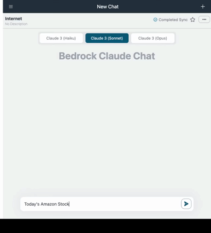

# LLM-powered Agent (ReAct)

## What is the Agent (ReAct) ?

An Agent is an advanced AI system that utilizes large language models (LLMs) as its central computational engine. It combines the reasoning capabilities of LLMs with additional functionalities such as planning and tool usage to autonomously perform complex tasks. Agents can break down complicated queries, generate step-by-step solutions, and interact with external tools or APIs to gather information or execute subtasks.

This sample implements an Agent using the [ReAct (Reasoning + Acting)](https://www.promptingguide.ai/techniques/react) approach. ReAct enables the agent to solve complex tasks by combining reasoning and actions in an iterative feedback loop. The agent repeatedly goes through three key steps: Thought, Action, and Observation. It analyzes the current situation using the LLM, decides on the next action to take, executes the action using available tools or APIs, and learns from the observed results. This continuous process allows the agent to adapt to dynamic environments, improve its task-solving accuracy, and provide context-aware solutions.

## Example Use Case

An Agent using ReAct can be applied in various scenarios, providing accurate and efficient solutions.

### Text-to-SQL Example

A user asks for "the total sales for the last quarter." The Agent interprets this request, converts it into a SQL query, executes it against the database, and presents the results. For the detail, see: [Text-to-SQL tool](../examples/agents/tools/text_to_sql/)

### Financial Forecasting Example

A financial analyst needs to forecast next quarter's revenue. The Agent gathers relevant data, performs necessary calculations using financial models, and generates a detailed forecast report, ensuring the accuracy of the projections.

## To use the Agent feature

To enable the Agent functionality for your customized chatbot, follow these steps:

1. Navigate to the Agent section in the custom bot screen.

2. In the Agent section, you will find a list of available tools that can be used by the Agent. By default, all tools are disabled.

3. To activate a tool, simply toggle the switch next to the desired tool. Once a tool is enabled, the Agent will have access to it and can utilize it when processing user queries.

> [!Important]
> It's important to note that enabling any tool in the Agent section will automatically treat the ["Knowledge" functionality](RAG.md) as a tool as well. This means that the LLM will autonomously determine whether to use the "Knowledge" to answer user queries, considering it as one of the available tools at its disposal.

4. By default "Internet Search" tool is provided. This tool allows the Agent to fetch information from the internet to answer user questions.

This tool depends [DuckDuckGo](https://duckduckgo.com/) which has rate limit. It's suitable for PoC or demo purpose, but if you'd like to use for production environment, we recommend to use another search API.

5. You can develop and add your own custom tools to extend the capabilities of the Agent. Refer to the [How to develop your own tools](#how-to-develop-your-own-tools) section for more information on creating and integrating custom tools.

## How to develop your own tools

To develop your own custom tools for the Agent, follow these guidelines:

- Create a new class that inherits from the `BaseTool` class. Although the interface is compatible with LangChain, this sample implementation provides its own `BaseTool` class, which you should inherit from ([source](../backend/app/agents/tools/base.py)).

- Refer to the sample implementation of a [BMI calculation tool](../examples/agents/tools/bmi/bmi.py). This example demonstrates how to create a tool that calculates the Body Mass Index (BMI) based on user input.

  - The name and description declared on the tool are used when LLM considers which tool should be used to respond user's question. In other words, they are embedded on prompt when invoke LLM. So it's recommended to describe precisely as much as possible.

- [Optional] Once you have implemented your custom tool, it's recommended to verify its functionality using test script ([example](../examples/agents/tools/bmi/test_bmi.py)). This script will help you ensure that your tool is working as expected.

- After completing the development and testing of your custom tool, move the implementation file to the [backend/app/agents/tools/](../backend/app/agents/tools/) directory. Then open [backend/app/agents/utils.py](../backend/app/agents/utils.py) and edit `get_available_tools` so that the user can select the tool developed.

- [Optional] Add clear names and descriptions for the frontend. This step is optional, but if you don't do this step, the tool name and description declared in your tool will be used. They are for LLM but not for the user, so it's recommended to add a dedicated explanation for better UX.

  - Edit i18n files. Open [en/index.ts](../frontend/src/i18n/en/index.ts) and add your own `name` and `description` on `agent.tools`.
  - Edit `xx/index.ts` as well. Where `xx` represents the country code you wish.
  - Edit [formatDescription.ts](../frontend/src/features/agent/functions/formatDescription.ts) so that frontend app can refer to it correctly.

- Run `cdk deploy` to deploy your changes. This will make your custom tool available in the custom bot screen.

In addition to the BMI calculation example, there are other tool examples available for reference, including [Text-to-SQL](../examples/agents/tools/text_to_sql/). Feel free to explore these [examples](../examples/agents/tools/) to gain insights and inspiration for creating your own tools.

## Contribution

**Contributions to the tool repository are welcome!** If you develop a useful and well-implemented tool, consider contributing it to the project by submitting an issue or a pull request.
