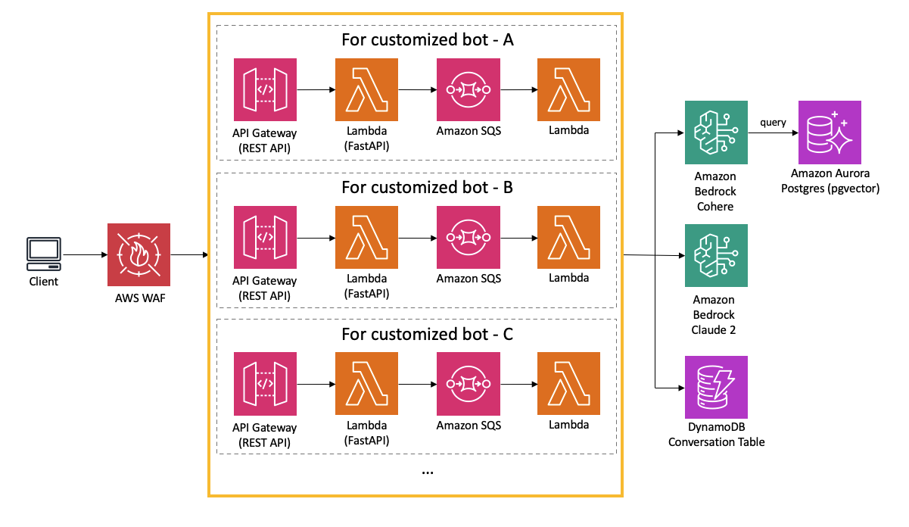

# API Publication

## Overview

This sample includes a feature for publishing APIs. It is designed to be integrated into actual production environments without the need for a frontend, as the existing services do not require a chat interface for integration. The user experience (UX) desired to be provided to the end-user is not in the form of a chat. While a chat UI is convenient for preliminary validation, the actual implementation is more suited for backend reuse. After simple validation through chat is completed, it is often more convenient to have a clearly specified API provided as a standalone feature. Therefore, this sample comes equipped with the capability to publish customized bots. By entering settings for quotas, throttling, origins, etc., an endpoint is published along with an API key.

## Security

Using only an API key is not recommended as described in: [AWS API Gateway Developer Guide](https://docs.aws.amazon.com/apigateway/latest/developerguide/api-gateway-api-usage-plans.html). Consequently, this sample implements a simple IP address restriction via AWS WAF. The WAF rule is applied commonly across the application due to cost considerations, under the assumption that the sources one would want to restrict are likely the same across all issued APIs. **Please adhere to your organization's security policy for actual implementation.** Also see [Architecture](#architecture) section.

## How to publish customized bot API

TODO

- Add user to cognito group
- Screenshots

## Architecture

The API is published as following diagram:

Once a user determined to publish the bot, [AWS CodeBuild](https://aws.amazon.com/codebuild/) launch CDK deployment task to provision the API stack (Also see: [CDK definition](../cdk/lib/api-publishment-stack.ts)) which contains API Gateway, Lambda and SQS. SQS is used to decouple user request and LLM operation because generating output may exceed 30sec, which is the limit of API Gateway quota. To fetch the output, need to access the API asynchronously. For more the detail, see [API Specification](#api-specification).

## API specification

See [here](https://aws-samples.github.io/bedrock-claude-chat).

TODO
