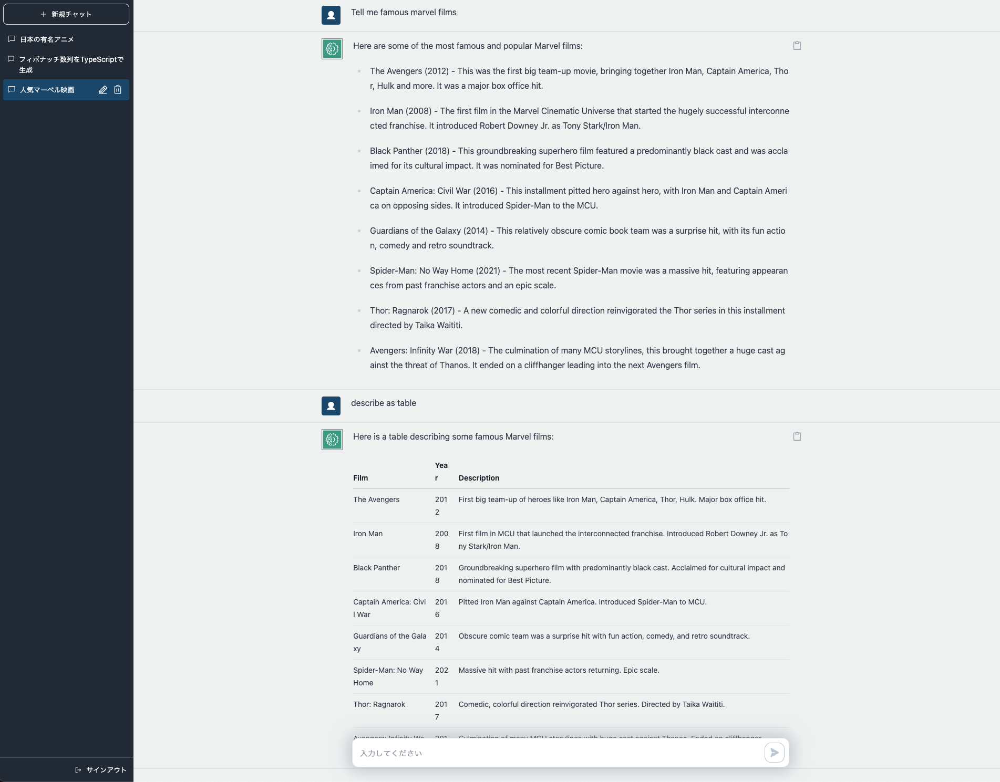

# Bedrock Claude Chat

日本語は[こちら](./docs/README_ja.md)

> **Warning**
> The current version (`v0.2.x`) has no compatibility with ex version (`v0.1.0`) due to change of the conversation schema. Please note that conversations stored in DynamoDB with ex version cannot rendered.

This repository is a sample chatbot using the Anthropic company's LLM [Claude 2](https://www.anthropic.com/index/claude-2), one of the foundational models provided by [Amazon Bedrock](https://aws.amazon.com/bedrock/) for generative AI. This sample is currently developed for use by Japanese speakers, but it is also possible to speak to the chatbot in English.




## Architecture

It's an architecture built on AWS managed services, eliminating the need for infrastructure management. Utilizing Amazon Bedrock, there's no need to communicate with APIs outside of AWS. This enables deploying scalable, reliable, and secure applications.

- [Amazon DynamoDB](https://aws.amazon.com/dynamodb/): NoSQL database for conversation history storage
- [Amazon API Gateway](https://aws.amazon.com/api-gateway/) + [AWS Lambda](https://aws.amazon.com/lambda/): Backend API endpoint ([AWS Lambda Web Adapter](https://github.com/awslabs/aws-lambda-web-adapter), [FastAPI](https://fastapi.tiangolo.com/))
- [Amazon CloudFront](https://aws.amazon.com/cloudfront/) + [S3](https://aws.amazon.com/s3/): Frontend application delivery ([React](https://react.dev/), [Tailwind CSS](https://tailwindcss.com/))
- [AWS WAF](https://aws.amazon.com/waf/): IP address restriction
- [Amazon Cognito](https://aws.amazon.com/cognito/): User authentication
- [Amazon Bedrock](https://aws.amazon.com/bedrock/): Managed service to utilize foundational models via APIs


## Features and Roadmap

- [x] Authentication (Sign-up, Sign-in)
- [x] Creation, storage, and deletion of conversations
- [x] Copying of chatbot replies
- [x] Automatic subject suggestion for conversations
- [x] Syntax highlighting for code
- [x] Rendering of Markdown'
- [x] Streaming Response
- [x] IP address restriction
- [x] Edit message & re-send
- [ ] Save and re-use prompt template
- [ ] I18n (English / Japanese)

## Deployment

### 🚀 Easy Deployment

> Note: Bedrock currently does NOT support all regions. Following procedure will deploy Bedrock resource to `us-east-1` (Other resources will be deployed on the region where the CloudShell run). If you need to change the Bedrock region, follow the instructions later in this chapter to deploy using CDK directly.

- Open [CloudShell](https://console.aws.amazon.com/cloudshell/home)
- Clone this repository

```sh
git clone https://github.com/aws-samples/bedrock-claude-chat.git
```

- Run deployment via following commands

```sh
cd bedrock-claude-chat
chmod +x bin.sh
./bin.sh
```

- After about 10 minutes, you will get the following output, which you can access from your browser

```
Frontend URL: https://xxxxxxxxx.cloudfront.net
```


The sign-up screen will appear as shown above, where you can register your email and log in.

### Deploy using CDK

Easy Deployment uses [AWS CodeBuild](https://aws.amazon.com/codebuild/) to perform deployment by CDK internally. This section describes the procedure for deploying directly with CDK.

- Please have UNIX commands and a Node.js runtime environment. If not, you can also use [Cloud9](https://github.com/aws-samples/cloud9-setup-for-prototyping)
- Clone this repository

```
git clone https://github.com/aws-samples/bedrock-claude-chat
```

- Install npm packages

```
cd bedrock-claude-chat
cd cdk
npm ci
```

- Install [AWS CDK](https://aws.amazon.com/cdk/)

```
npm i -g aws-cdk
```

- Before deploying the CDK, you will need to work with Bootstrap once for the region you are deploying to. In this example, we will deploy to the us-east-1 region. Please replace your account id into `<account id>`.

```
cdk bootstrap aws://<account id>/us-east-1
```

- If necessary, edit the following entries in [cdk.json](. /cdk/cdk.json) if necessary.

  - `bedrockRegion`: Region where Bedrock is available.
  - `allowedIpV4AddressRanges`, `allowedIpV6AddressRanges`: Allowed IP Address range.

- Deploy this sample project

```
cdk deploy --require-approval never --all
```

- You will get output similar to the following. The URL of the web app will be output in `BedrockChatStack.FrontendURL`, so please access it from your browser.

```sh
 ✅  BedrockChatStack

✨  Deployment time: 78.57s

Outputs:
BedrockChatStack.AuthUserPoolClientIdXXXXX = xxxxxxx
BedrockChatStack.AuthUserPoolIdXXXXXX = ap-northeast-1_XXXX
BedrockChatStack.BackendApiBackendApiUrlXXXXX = https://xxxxx.execute-api.ap-northeast-1.amazonaws.com
BedrockChatStack.FrontendURL = https://xxxxx.cloudfront.net
```

## Others

### Configure text generation parameters

Edit [config.py](./backend/common/config.py) and run `cdk deploy`.

```py
GENERATION_CONFIG = {
    "max_tokens_to_sample": 500,
    "temperature": 0.0,
    "top_k": 250,
    "top_p": 0.999,
    "stop_sequences": ["Human: ", "Assistant: "],
}
```

### Local Frontend Development

In this sample, you can locally modify and launch the frontend using AWS resources (`API Gateway`, `Cognito`, etc.) that have been deployed with `cdk deploy`.

1. Refer to [Deploy using CDK](#deploy-using-cdk) for deploying on the AWS environment.
2. Copy the `frontend/.env.template` and save it as `frontend/.env.local`.
3. Fill in the contents of `.env.local` based on the output results of `cdk deploy` (such as `BedrockChatStack.AuthUserPoolClientIdXXXXX`).
4. Execute the following command:

```zsh
cd frontend && npm run dev
```

### Using Streaming

Currently, the environment variable `VITE_APP_USE_STREAMING` is specified on the frontend side. It's recommended to set it to `false` when running the backend locally and `true` when operating on AWS.  
When streaming is enabled, text is generated in real-time due to the streaming of content generation results.

### Remove resources

If using cli and CDK, please `cdk destroy`. If not, access to [CloudFormation](https://console.aws.amazon.com/cloudformation/home) then delete `BedrockChatStack` and `FrontendWafStack` manually. Please note that `FrontendWafStack` is on `us-east-1` region.

### RAG using Kendra

In this sample, we have not implemented RAG using Kendra. This is because when it comes to real-world deployments, factors such as access control policies, the presence or absence of data connectors, and the methods for authentication and authorization for the connected data sources can be quite diverse depending on the organization, making it difficult to generalize them in a simple manner. To put this into practice, you should consider downsides like decreased latency and increased token consumption. For these reasons, a proof of concept (PoC) to verify search accuracy is essential. Therefore, we recommend using assets like [jp-rag-sample](https://github.com/aws-samples/jp-rag-sample) (In Japanese) for your PoC.

## Authors

- [Takehiro Suzuki](https://github.com/statefb)
- [Yusuke Wada](https://github.com/wadabee)
