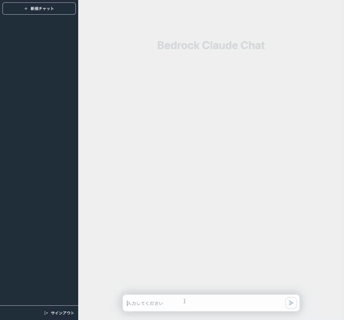

# Bedrock Claude Chat


> **Warning**
> The current version (`v0.2.x`) has no compatibility with ex version (`v0.1.0`) due to the change of the conversation schema. Please note that conversations stored in DynamoDB with ex version cannot be rendered.

This repository is a sample chatbot using the Anthropic company's LLM [Claude 2](https://www.anthropic.com/index/claude-2), one of the foundational models provided by [Amazon Bedrock](https://aws.amazon.com/bedrock/) for generative AI.



## 📚 Supported Languages

- English 💬
- 日本語 💬 (ドキュメントは[こちら](./docs/README_ja.md))
- 한국어 💬
- 中文 💬

## 🚀 Super-easy Deployment

- Open [Bedrock Model access](https://us-east-1.console.aws.amazon.com/bedrock/home?region=us-east-1#/modelaccess) > `Edit` > Check `Claude` and `Save changes`
- Open [CloudShell](https://console.aws.amazon.com/cloudshell/home)
- Run deployment via following commands

```sh
git clone https://github.com/aws-samples/bedrock-claude-chat.git
cd bedrock-claude-chat
chmod +x bin.sh
./bin.sh
```

- After about 20 minutes, you will get the following output, which you can access from your browser

```
Frontend URL: https://xxxxxxxxx.cloudfront.net
```


The sign-up screen will appear as shown above, where you can register your email and log in.

> **Important**
> This deployment method allows anyone with the URL to sign up. For production use, we strongly recommend adding IP address restrictions or disabling self-signup to mitigate security risks. To set up, [Deploy using CDK](#deploy-using-cdk) for IP address restrictions or [Disable self sign up](#disable-self-sign-up).

## Architecture

It's an architecture built on AWS managed services, eliminating the need for infrastructure management. Utilizing Amazon Bedrock, there's no need to communicate with APIs outside of AWS. This enables deploying scalable, reliable, and secure applications.

- [Amazon DynamoDB](https://aws.amazon.com/dynamodb/): NoSQL database for conversation history storage
- [Amazon API Gateway](https://aws.amazon.com/api-gateway/) + [AWS Lambda](https://aws.amazon.com/lambda/): Backend API endpoint ([AWS Lambda Web Adapter](https://github.com/awslabs/aws-lambda-web-adapter), [FastAPI](https://fastapi.tiangolo.com/))
- [Amazon SNS](https://aws.amazon.com/sns/): Used to decouple streaming calls between API Gateway and Bedrock because streaming responses can take over 30 seconds in total, exceeding the limitations of HTTP integration (See [quota](https://docs.aws.amazon.com/apigateway/latest/developerguide/limits.html)).
- [Amazon CloudFront](https://aws.amazon.com/cloudfront/) + [S3](https://aws.amazon.com/s3/): Frontend application delivery ([React](https://react.dev/), [Tailwind CSS](https://tailwindcss.com/))
- [AWS WAF](https://aws.amazon.com/waf/): IP address restriction
- [Amazon Cognito](https://aws.amazon.com/cognito/): User authentication
- [Amazon Bedrock](https://aws.amazon.com/bedrock/): Managed service to utilize foundational models via APIs


## Features and Roadmap

- [x] Authentication (Sign-up, Sign-in)
- [x] Creation, storage, and deletion of conversations
- [x] Copying of chatbot replies
- [x] Automatic subject suggestion for conversations
- [x] Syntax highlighting for code
- [x] Rendering of Markdown'
- [x] Streaming Response
- [x] IP address restriction
- [x] Edit message & re-send
- [x] I18n
- [ ] Save and re-use prompt template

## Deploy using CDK

Super-easy Deployment uses [AWS CodeBuild](https://aws.amazon.com/codebuild/) to perform deployment by CDK internally. This section describes the procedure for deploying directly with CDK.

- Please have UNIX and a Node.js runtime environment. If not, you can also use [Cloud9](https://github.com/aws-samples/cloud9-setup-for-prototyping)
- Clone this repository

```
git clone https://github.com/aws-samples/bedrock-claude-chat
```

- Install npm packages

```
cd bedrock-claude-chat
cd cdk
npm ci
```

- Install [AWS CDK](https://aws.amazon.com/cdk/)

```
npm i -g aws-cdk
```

- Before deploying the CDK, you will need to work with Bootstrap once for the region you are deploying to. In this example, we will deploy to the us-east-1 region. Please replace your account id into `<account id>`.

```
cdk bootstrap aws://<account id>/us-east-1
```

- If necessary, edit the following entries in [cdk.json](./cdk/cdk.json) if necessary.

  - `bedrockRegion`: Region where Bedrock is available. **NOTE: Bedrock does NOT support all regions for now.**
  - `allowedIpV4AddressRanges`, `allowedIpV6AddressRanges`: Allowed IP Address range.

- Deploy this sample project

```
cdk deploy --require-approval never --all
```

- You will get output similar to the following. The URL of the web app will be output in `BedrockChatStack.FrontendURL`, so please access it from your browser.

```sh
 ✅  BedrockChatStack

✨  Deployment time: 78.57s

Outputs:
BedrockChatStack.AuthUserPoolClientIdXXXXX = xxxxxxx
BedrockChatStack.AuthUserPoolIdXXXXXX = ap-northeast-1_XXXX
BedrockChatStack.BackendApiBackendApiUrlXXXXX = https://xxxxx.execute-api.ap-northeast-1.amazonaws.com
BedrockChatStack.FrontendURL = https://xxxxx.cloudfront.net
```

## Others

### Configure text generation parameters

Edit [config.py](./backend/app/config.py) and run `cdk deploy`.

```py
GENERATION_CONFIG = {
    "max_tokens_to_sample": 500,
    "temperature": 0.6,
    "top_k": 250,
    "top_p": 0.999,
    "stop_sequences": ["Human: ", "Assistant: "],
}
```

### Remove resources

If using cli and CDK, please `cdk destroy`. If not, access to [CloudFormation](https://console.aws.amazon.com/cloudformation/home) then delete `BedrockChatStack` and `FrontendWafStack` manually. Please note that `FrontendWafStack` is on `us-east-1` region.

### Language Settings

This asset automatically detects the language using [i18next-browser-languageDetector](https://github.com/i18next/i18next-browser-languageDetector).You can switch languages from the application menu. Alternatively, you can use Query String to set the language as shown below.

> `https://example.com?lng=ja`

### Disable self sign up

This sample has self sign up enabled by default. To disable self sign up, open [auth.ts](./cdk/lib/constructs/auth.ts) and switch `selfSignUpEnabled` as `false`, then re-deploy.

```ts
const userPool = new UserPool(this, "UserPool", {
  passwordPolicy: {
    requireUppercase: true,
    requireSymbols: true,
    requireDigits: true,
    minLength: 8,
  },
  // true -> false
  selfSignUpEnabled: false,
  signInAliases: {
    username: false,
    email: true,
  },
});
```

### Local Development

See [LOCAL DEVELOPMENT](./docs/LOCAL_DEVELOPMENT.md).

### Contribution

Thank you for considering contribution on this repository! We welcome for bug fixes, language translation, feature enhancements, and other improvements. Please see following:

- [Local Development](./docs/LOCAL_DEVELOPMENT.md)
- [CONTRIBUTING](./CONTRIBUTING.md)

### RAG using Kendra

In this sample, we have not implemented RAG using Kendra. This is because when it comes to real-world deployments, factors such as access control policies, the presence or absence of data connectors, and the methods for authentication and authorization for the connected data sources can be quite diverse depending on the organization, making it difficult to generalize them in a simple manner. To put this into practice, you should consider downsides like decreased latency and increased token consumption. For these reasons, a proof of concept (PoC) to verify search accuracy is essential.

- [generative-ai-use-cases-jp](https://github.com/aws-samples/generative-ai-use-cases-jp) (In Japanese)
- [simple-lex-kendra-jp](https://github.com/aws-samples/simple-lex-kendra-jp) (In Japanese)
- [jp-rag-sample](https://github.com/aws-samples/jp-rag-sample) (In Japanese)

## Authors

- [Takehiro Suzuki](https://github.com/statefb)
- [Yusuke Wada](https://github.com/wadabee)

## License

This library is licensed under the MIT-0 License. See the LICENSE file.
