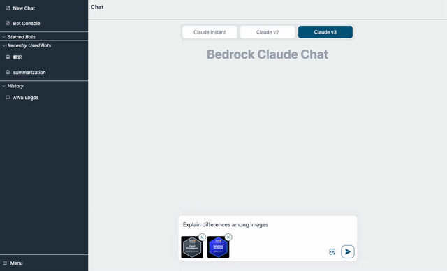
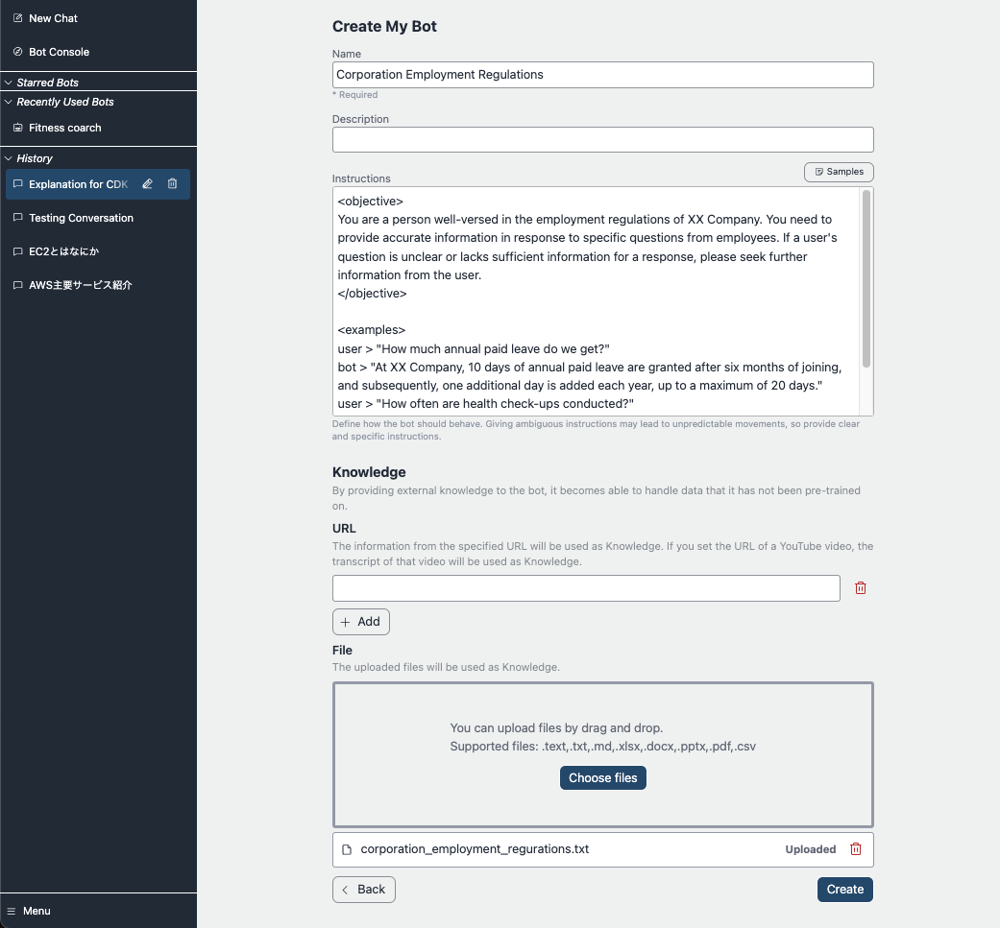
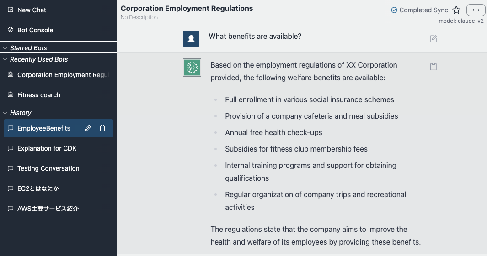

# Bedrock Claude Chat


> [!Warning]
> If you are using old version (e.g. `v0.4.x`) and wish to use the latest version, refer [migration guide](./docs/migration/V0_TO_V1.md). Without any care, **ALL DATA IN Aurora cluster WILL BE DESTROYED, and NO LONGER USERS CANNOT USE EXISTING BOTS WITH KNOWLEDGE AND CREATE NEW BOTS**.

This repository is a sample chatbot using the Anthropic company's LLM [Claude](https://www.anthropic.com/), one of the foundational models provided by [Amazon Bedrock](https://aws.amazon.com/bedrock/) for generative AI.

### Basic Conversation

Not only text but also images are available with [Anthropic's Claude 3](https://www.anthropic.com/news/claude-3-family). Currently we support `Haiku`, `Sonnet` and `Opus`.



### Bot Personalization

Add your own instruction and give external knowledge as URL or files (a.k.a [RAG](./docs/RAG.md)). The bot can be shared among application users. The customized bot also can be published as stand-alone API (See the [detail](./docs/PUBLISH_API.md)).





> [!Important]
> For governance reasons, only allowed users are able to create customized bots. To allow the creation of customized bots, the user must be a member of group called `CreatingBotAllowed`, which can be set up via the management console > Amazon Cognito User pools or aws cli. Note that the user pool id can be referred by accessing CloudFormation > BedrockChatStack > Outputs > `AuthUserPoolIdxxxx`.

### Administrator dashboard

Analyze usage for each user / bot on administrator dashboard. [detail](./docs/ADMINISTRATOR.md)


### LLM-powered Agent

By using the [Agent functionality](./docs/AGENT.md), your chatbot can automatically handle more complex tasks. For example, to answer a user's question, the Agent can retrieve necessary information from external tools or break down the task into multiple steps for processing.


## 📚 Supported Languages

- English 💬
- 日本語 💬 (ドキュメントは[こちら](./docs/README_ja.md))
- 한국어 💬
- 中文 💬
- Français 💬
- Deutsch 💬
- Español 💬
- Italian 💬

## 🚀 Super-easy Deployment

- In the us-east-1 region, open [Bedrock Model access](https://us-east-1.console.aws.amazon.com/bedrock/home?region=us-east-1#/modelaccess) > `Manage model access` > Check `Anthropic / Claude 3 Haiku`, `Anthropic / Claude 3 Sonnet`, `Anthropic / Claude 3.5 Sonnet` and `Cohere / Embed Multilingual` then `Save changes`.

<details>
<summary>Screenshot</summary>


</details>

- Open [CloudShell](https://console.aws.amazon.com/cloudshell/home) at the region where you want to deploy
- Run deployment via following commands. If you have specific security policy, please also refer [Optional Parameters](#optional-parameters).

```sh
git clone https://github.com/aws-samples/bedrock-claude-chat.git
cd bedrock-claude-chat
chmod +x bin.sh
./bin.sh
```

- You will be asked if a new user or using v1. If so, enter `y`.

### Optional Parameters

You can specify the following parameters during deployment to enhance security and customization:

- **--disable-self-register**: Disable self-registration (default: enabled). If this flag is set, you will need to create all users on cognito and it will not allow users to self register their accounts.
- **--ipv4-ranges**: Comma-separated list of allowed IPv4 ranges. (default: allow all ipv4 addresses)
- **--ipv6-ranges**: Comma-separated list of allowed IPv6 ranges. (default: allow all ipv6 addresses)
- **--allowed-signup-email-domains**: Comma-separated list of allowed email domains for sign-up. (default: no domain restriction)
- **--region**: Define the region where bedrock is available. (default: us-east-1)

#### Example command with parameters:

```sh
./bin.sh --disable-self-register --ipv4-ranges "192.0.2.0/25,192.0.2.128/25" --ipv6-ranges "2001:db8:1:2::/64,2001:db8:1:3::/64" --allowed-signup-email-domains "example.com,anotherexample.com" --region "us-west-2"
```

- After about 35 minutes, you will get the following output, which you can access from your browser

```
Frontend URL: https://xxxxxxxxx.cloudfront.net
```


The sign-up screen will appear as shown above, where you can register your email and log in.

> [!Important]
> Without setting the optional parameter, this deployment method allows anyone who knows the URL to sign up. For production use, it is strongly recommended to add IP address restrictions and disable self-signup to mitigate security risks (you can define allowed-signup-email-domains to restrict users so that only email addresses from your company’s domain can sign up). Use both ipv4-ranges and ipv6-ranges for IP address restrictions, and disable self-signup by using disable-self-register when executing ./bin.

## Architecture

It's an architecture built on AWS managed services, eliminating the need for infrastructure management. Utilizing Amazon Bedrock, there's no need to communicate with APIs outside of AWS. This enables deploying scalable, reliable, and secure applications.

- [Amazon DynamoDB](https://aws.amazon.com/dynamodb/): NoSQL database for conversation history storage
- [Amazon API Gateway](https://aws.amazon.com/api-gateway/) + [AWS Lambda](https://aws.amazon.com/lambda/): Backend API endpoint ([AWS Lambda Web Adapter](https://github.com/awslabs/aws-lambda-web-adapter), [FastAPI](https://fastapi.tiangolo.com/))
- [Amazon CloudFront](https://aws.amazon.com/cloudfront/) + [S3](https://aws.amazon.com/s3/): Frontend application delivery ([React](https://react.dev/), [Tailwind CSS](https://tailwindcss.com/))
- [AWS WAF](https://aws.amazon.com/waf/): IP address restriction
- [Amazon Cognito](https://aws.amazon.com/cognito/): User authentication
- [Amazon Bedrock](https://aws.amazon.com/bedrock/): Managed service to utilize foundational models via APIs. Claude is used for chat response and Cohere for vector embedding
- [Amazon EventBridge Pipes](https://aws.amazon.com/eventbridge/pipes/): Receiving event from DynamoDB stream and launching ECS task to embed external knowledge
- [Amazon Elastic Container Service](https://aws.amazon.com/ecs/): Run crawling, parsing and embedding tasks. [Cohere Multilingual](https://txt.cohere.com/multilingual/) is the model used for embedding.
- [Amazon Aurora PostgreSQL](https://aws.amazon.com/rds/aurora/): Scalable vector store with [pgvector](https://github.com/pgvector/pgvector) plugin
- [Amazon Athena](https://aws.amazon.com/athena/): Query service to analyze S3 bucket


## Deploy using CDK

Super-easy Deployment uses [AWS CodeBuild](https://aws.amazon.com/codebuild/) to perform deployment by CDK internally. This section describes the procedure for deploying directly with CDK.

- Please have UNIX, Docker and a Node.js runtime environment. If not, you can also use [Cloud9](https://github.com/aws-samples/cloud9-setup-for-prototyping)

> [!Important]
> If there is insufficient storage space in the local environment during deployment, CDK bootstrapping may result in an error. If you are running in Cloud9 etc., we recommend expanding the volume size of the instance before deploying.

- Clone this repository

```
git clone https://github.com/aws-samples/bedrock-claude-chat
```

- Install npm packages

```
cd bedrock-claude-chat
cd cdk
npm ci
```

- Install [AWS CDK](https://aws.amazon.com/cdk/)

```
npm i -g aws-cdk
```

- Before deploying the CDK, you will need to work with Bootstrap once for the region you are deploying to. In this example, we will deploy to the us-east-1 region. Please replace your account id into `<account id>`.

```
cdk bootstrap aws://<account id>/us-east-1
```

- If necessary, edit the following entries in [cdk.json](./cdk/cdk.json) if necessary.

  - `bedrockRegion`: Region where Bedrock is available. **NOTE: Bedrock does NOT support all regions for now.**
  - `allowedIpV4AddressRanges`, `allowedIpV6AddressRanges`: Allowed IP Address range.

- Deploy this sample project

```
cdk deploy --require-approval never --all
```

- You will get output similar to the following. The URL of the web app will be output in `BedrockChatStack.FrontendURL`, so please access it from your browser.

```sh
 ✅  BedrockChatStack

✨  Deployment time: 78.57s

Outputs:
BedrockChatStack.AuthUserPoolClientIdXXXXX = xxxxxxx
BedrockChatStack.AuthUserPoolIdXXXXXX = ap-northeast-1_XXXX
BedrockChatStack.BackendApiBackendApiUrlXXXXX = https://xxxxx.execute-api.ap-northeast-1.amazonaws.com
BedrockChatStack.FrontendURL = https://xxxxx.cloudfront.net
```

## Others

### Configure Mistral models support

Update `enableMistral` to `true` in [cdk.json](./cdk/cdk.json), and run `cdk deploy`.

```json
...
  "enableMistral": true,
```

> [!Important]
> This project focus on Anthropic Claude models, the Mistral models are limited supported. For example, prompt examples are based on Claude models. This is a Mistral-only option, once you toggled to enable Mistral models, you can only use Mistral models for all the chat features, NOT both Claude and Mistral models.

### Configure default text generation

Users can adjust the [text generation parameters](https://docs.anthropic.com/claude/reference/complete_post) from the custom bot creation screen. If the bot is not used, the default parameters set in [config.py](./backend/app/config.py) will be used.

```py
DEFAULT_GENERATION_CONFIG = {
    "max_tokens": 2000,
    "top_k": 250,
    "top_p": 0.999,
    "temperature": 0.6,
    "stop_sequences": ["Human: ", "Assistant: "],
}
```

### Remove resources

If using cli and CDK, please `cdk destroy`. If not, access [CloudFormation](https://console.aws.amazon.com/cloudformation/home) and then delete `BedrockChatStack` and `FrontendWafStack` manually. Please note that `FrontendWafStack` is in `us-east-1` region.

### Stopping Vector DB for RAG

By setting [cdk.json](./cdk/cdk.json) in the following CRON format, you can stop and restart Aurora Serverless resources created by the [VectorStore construct](./cdk/lib/constructs/vectorstore.ts). Applying this setting can reduce operating costs. By default, Aurora Serverless is always running. Note that it will be executed in UTC time.

```json
...
"rdbSchedules": {
  "stop": {
    "minute": "50",
    "hour": "10",
    "day": "*",
    "month": "*",
    "year": "*"
  },
  "start": {
    "minute": "40",
    "hour": "2",
    "day": "*",
    "month": "*",
    "year": "*"
  }
}
```

### Language Settings

This asset automatically detects the language using [i18next-browser-languageDetector](https://github.com/i18next/i18next-browser-languageDetector). You can switch languages from the application menu. Alternatively, you can use Query String to set the language as shown below.

> `https://example.com?lng=ja`

### Disable self sign up

This sample has self sign up enabled by default. To disable self sign up, open [cdk.json](./cdk/cdk.json) and switch `selfSignUpEnabled` as `false`. If you configure [external identity provider](#external-identity-provider), the value will be ignored and automatically disabled.

### Restrict Domains for Sign-Up Email Addresses

By default, this sample does not restrict the domains for sign-up email addresses. To allow sign-ups only from specific domains, open `cdk.json` and specify the domains as a list in `allowedSignUpEmailDomains`.

```ts
"allowedSignUpEmailDomains": ["example.com"],
```

### External Identity Provider

This sample supports external identity provider. Currently we support [Google](./docs/idp/SET_UP_GOOGLE.md) and [custom OIDC provider](./docs/idp/SET_UP_CUSTOM_OIDC.md).

### Add new users to groups automatically

This sample has the following groups to give permissions to users:

- [`Admin`](./docs/ADMINISTRATOR.md)
- [`CreatingBotAllowed`](#bot-personalization)
- [`PublishAllowed`](./docs/PUBLISH_API.md)

If you want newly created users to automatically join groups, you can specify them in [cdk.json](./cdk/cdk.json).

```json
"autoJoinUserGroups": ["CreatingBotAllowed"],
```

By default, newly created users will be joined to the `CreatingBotAllowed` group.

### Local Development

See [LOCAL DEVELOPMENT](./docs/LOCAL_DEVELOPMENT.md).

### Contribution

Thank you for considering contributing to this repository! We welcome bug fixes, language translations (i18n), feature enhancements, [agent tools](./docs/AGENT.md#how-to-develop-your-own-tools), and other improvements.

For feature enhancements and other improvements, **before creating a Pull Request, we would greatly appreciate it if you could create a Feature Request Issue to discuss the implementation approach and details. For bug fixes and language translations (i18n), proceed with creating a Pull Request directly.**

Please also take a look at the following guidelines before contributing:

- [Local Development](./docs/LOCAL_DEVELOPMENT.md)
- [CONTRIBUTING](./CONTRIBUTING.md)

### RAG (Retrieval Augmented Generation)

See [here](./docs/RAG.md).

## Contacts

- [Takehiro Suzuki](https://github.com/statefb)
- [Yusuke Wada](https://github.com/wadabee)
- [Yukinobu Mine](https://github.com/Yukinobu-Mine)

## Contributors

[](https://github.com/aws-samples/bedrock-claude-chat/graphs/contributors)

## License

This library is licensed under the MIT-0 License. See [the LICENSE file](./LICENSE).
