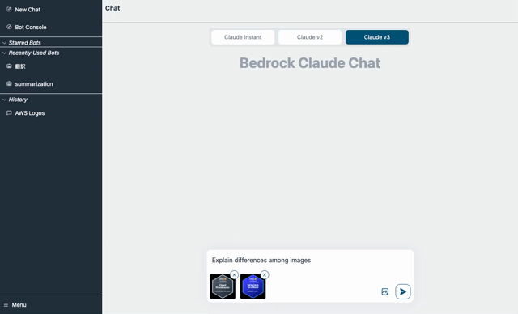
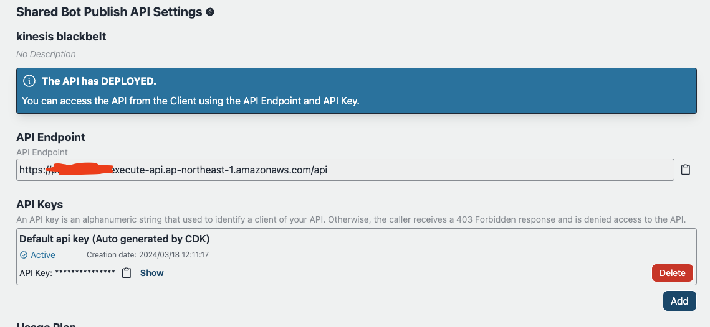
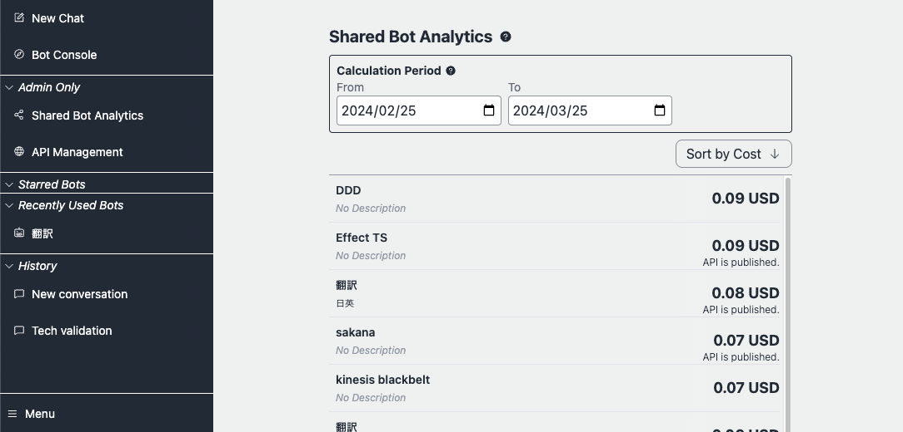
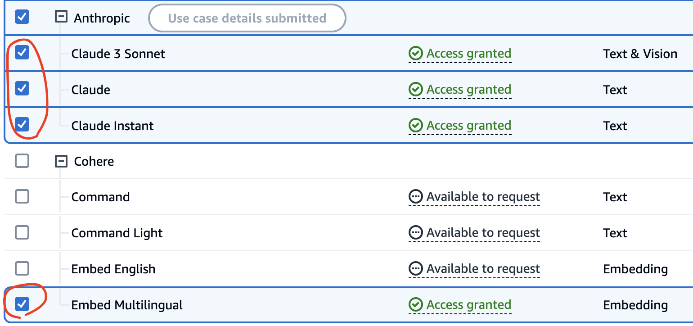
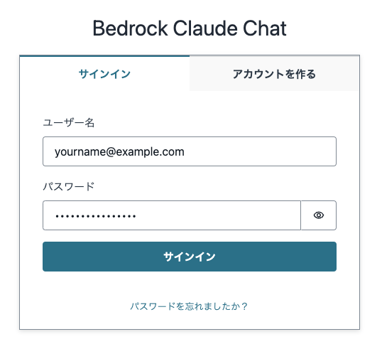
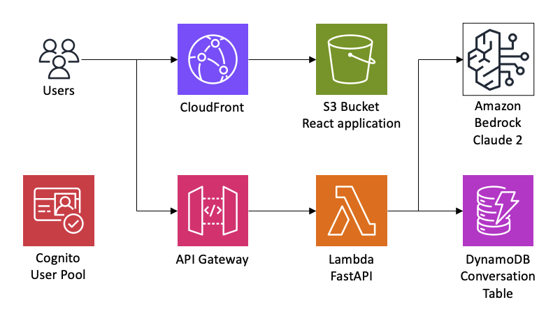

<h1 align="center">Bedrock Chat (BrChat)</h1>

<p align="center">
  
  
  
  <a href="https://github.com/aws-samples/bedrock-chat/issues?q=is%3Aissue%20state%3Aopen%20label%3Aroadmap">
    
  </a>
</p>

[English](https://github.com/aws-samples/bedrock-chat/blob/v3/README.md) | [日本語](https://github.com/aws-samples/bedrock-chat/blob/v3/docs/README_ja-JP.md) | [한국어](https://github.com/aws-samples/bedrock-chat/blob/v3/docs/README_ko-KR.md) | [中文](https://github.com/aws-samples/bedrock-chat/blob/v3/docs/README_zh-CN.md) | [Français](https://github.com/aws-samples/bedrock-chat/blob/v3/docs/README_fr-FR.md) | [Deutsch](https://github.com/aws-samples/bedrock-chat/blob/v3/docs/README_de-DE.md) | [Español](https://github.com/aws-samples/bedrock-chat/blob/v3/docs/README_es-ES.md) | [Italian](https://github.com/aws-samples/bedrock-chat/blob/v3/docs/README_it-IT.md) | [Norsk](https://github.com/aws-samples/bedrock-chat/blob/v3/docs/README_nb-NO.md) | [ไทย](https://github.com/aws-samples/bedrock-chat/blob/v3/docs/README_th-TH.md) | [Bahasa Indonesia](https://github.com/aws-samples/bedrock-chat/blob/v3/docs/README_id-ID.md) | [Bahasa Melayu](https://github.com/aws-samples/bedrock-chat/blob/v3/docs/README_ms-MY.md) | [Tiếng Việt](https://github.com/aws-samples/bedrock-chat/blob/v3/docs/README_vi-VN.md) | [Polski](https://github.com/aws-samples/bedrock-chat/blob/v3/docs/README_pl-PL.md) | [Português Brasil](https://github.com/aws-samples/bedrock-chat/blob/v3/docs/README_pt-BR.md)

A multilingual generative AI platform powered by [Amazon Bedrock](https://aws.amazon.com/bedrock/).
Supports chat, custom bots with knowledge (RAG), bot sharing via a bot store, and task automation using agents.



> [!Warning]
>
> **V3 released. To update, please carefully review the [migration guide](./docs/migration/V2_TO_V3.md).** Without any care, **BOTS FROM V2 WILL BECOME UNUSABLE.**

### Bot Personalization / Bot store

Add your own instruction and knowledge (a.k.a [RAG](https://aws.amazon.com/what-is/retrieval-augmented-generation/). The bot can be shared among application users via bot store market place. The customized bot also can be published as stand-alone API (See the [detail](./docs/PUBLISH_API.md)).

<details>
<summary>Screenshots</summary>




You can also import existing [Amazon Bedrock's KnowledgeBase](https://aws.amazon.com/bedrock/knowledge-bases/).


</details>

> [!Important]
> For governance reasons, only allowed users are able to create customized bots. To allow the creation of customized bots, the user must be a member of group called `CreatingBotAllowed`, which can be set up via the management console > Amazon Cognito User pools or aws cli. Note that the user pool id can be referred by accessing CloudFormation > BedrockChatStack > Outputs > `AuthUserPoolIdxxxx`.

### Multi-Tenant Usage of Knowledge Base

In Amazon Bedrock Knowledge Bases, by default, the number of Knowledge Bases that can be created in a single AWS account is limited to 100. To work around this limitation, you can use 'multi-tenant' mode, where a Knowledge Base with common settings is shared among multiple bots, and files uploaded by each bot are filtered by attaching the Bot ID as metadata.

Newly created bots will have multi-tenant mode enabled by default. To migrate existing bots to multi-tenant mode, change the bot's knowledge settings to "Create a tenant in a shared Knowledge Base."

To migrate multiple bots to multi-tenant mode in bulk, execute commands like the following:

```bash
aws dynamodb execute-statement --statement "UPDATE \"$BotTableNameV3\" SET BedrockKnowledgeBase.type='shared' SET SyncStatus='QUEUED' WHERE PK='$UserID' AND SK='BOT#$BotID'"
# Execute for all target bots

aws stepfunctions start-execution --state-machine-arn $EmbeddingStateMachineArn
```

### Administrative features

API Management, Mark bots as essential, Analyze usage for bots. [detail](./docs/ADMINISTRATOR.md)

<details>
<summary>Screenshots</summary>


)

</details>

### Agent

By using the [Agent functionality](./docs/AGENT.md), your chatbot can automatically handle more complex tasks. For example, to answer a user's question, the Agent can retrieve necessary information from external tools or break down the task into multiple steps for processing.

<details>
<summary>Screenshots</summary>


</details>

## 🎓Workshop

A comprehensive workshop is available [here](https://catalog.us-east-1.prod.workshops.aws/workshops/4bf8d30b-f7c9-440a-a853-9394a41909d2/en-US).

<details>
<summary>Screenshot</summary>


</details>

## 🚀 Super-easy Deployment

- In the us-east-1 region, open [Bedrock Model access](https://us-east-1.console.aws.amazon.com/bedrock/home?region=us-east-1#/modelaccess) > `Manage model access` > Check all of models you wish to use and then `Save changes`.

<details>
<summary>Screenshot</summary>



</details>

### Supported regions

Please make sure that you deploy Bedrock Chat in a region [where OpenSearch Serverless and Ingestion APIs are available](https://docs.aws.amazon.com/general/latest/gr/opensearch-service.html), if you want to use bots and create knowledge bases (OpenSearch Serverless is the default choice). As of August 2025, the following regions are supported: us-east-1, us-east-2, us-west-1, us-west-2, ap-south-1, ap-northeast-1, ap-northeast-2, ap-southeast-1, ap-southeast-2, ca-central-1, eu-central-1, eu-west-1, eu-west-2, eu-south-2, eu-north-1, sa-east-1

For the **bedrock-region** parameter you need to choose a region [where Bedrock is available](https://docs.aws.amazon.com/general/latest/gr/bedrock.html).

- Open [CloudShell](https://console.aws.amazon.com/cloudshell/home) at the region where you want to deploy
- Run deployment via following commands. If you want to specify the version to deploy or need to apply security policies, please specify the appropriate parameters from [Optional Parameters](#optional-parameters).

```sh
git clone https://github.com/aws-samples/bedrock-chat.git
cd bedrock-chat
chmod +x bin.sh
./bin.sh
```

- You will be asked if a new user or using v3. If you are not a continuing user from v0, please enter `y`.

### Optional Parameters

You can specify the following parameters during deployment to enhance security and customization:

- **--disable-self-register**: Disable self-registration (default: enabled). If this flag is set, you will need to create all users on cognito and it will not allow users to self register their accounts.
- **--enable-lambda-snapstart**: Enable [Lambda SnapStart](https://docs.aws.amazon.com/lambda/latest/dg/snapstart.html) (default: disabled). If this flag is set, improves cold start times for Lambda functions, providing faster response times for better user experience.
- **--ipv4-ranges**: Comma-separated list of allowed IPv4 ranges. (default: allow all ipv4 addresses)
- **--ipv6-ranges**: Comma-separated list of allowed IPv6 ranges. (default: allow all ipv6 addresses)
- **--disable-ipv6**: Disable connections over IPv6. (default: enabled)
- **--allowed-signup-email-domains**: Comma-separated list of allowed email domains for sign-up. (default: no domain restriction)
- **--bedrock-region**: Define the region where bedrock is available. (default: us-east-1)
- **--repo-url**: The custom repo of Bedrock Chat to deploy, if forked or custom source control. (default: https://github.com/aws-samples/bedrock-chat.git)
- **--version**: The version of Bedrock Chat to deploy. (default: latest version in development)
- **--cdk-json-override**: You can override any CDK context values during deployment using the override JSON block. This allows you to modify the configuration without editing the cdk.json file directly.

Example usage:

```bash
./bin.sh --cdk-json-override '{
  "context": {
    "selfSignUpEnabled": false,
    "enableLambdaSnapStart": true,
    "allowedIpV4AddressRanges": ["192.168.1.0/24"],
    "allowedCountries": ["US", "CA"],
    "allowedSignUpEmailDomains": ["example.com"],
    "globalAvailableModels": [
      "claude-v3.7-sonnet",
      "claude-v3.5-sonnet",
      "amazon-nova-pro",
      "amazon-nova-lite",
      "llama3-3-70b-instruct"
    ]
  }
}'
```

The override JSON must follow the same structure as cdk.json. You can override any context values including:

- `selfSignUpEnabled`
- `enableLambdaSnapStart`
- `allowedIpV4AddressRanges`
- `allowedIpV6AddressRanges`
- `allowedCountries`
- `allowedSignUpEmailDomains`
- `bedrockRegion`
- `enableRagReplicas`
- `enableBedrockCrossRegionInference`
- `globalAvailableModels`: accepts a list of model IDs to enable. The default value is an empty list, which enables all models.
- `logoPath`: relative path to the logo asset within the frontend `public/` directory that appears at the top of the navigation drawer.
- And other context values defined in cdk.json

> [!Note]
> The override values will be merged with the existing cdk.json configuration during the deployment time in the AWS code build. Values specified in the override will take precedence over the values in cdk.json.

#### Example command with parameters:

```sh
./bin.sh --disable-self-register --ipv4-ranges "192.0.2.0/25,192.0.2.128/25" --ipv6-ranges "2001:db8:1:2::/64,2001:db8:1:3::/64" --allowed-signup-email-domains "example.com,anotherexample.com" --bedrock-region "us-west-2" --version "v1.2.6"
```

- After about 35 minutes, you will get the following output, which you can access from your browser

```
Frontend URL: https://xxxxxxxxx.cloudfront.net
```



The sign-up screen will appear as shown above, where you can register your email and log in.

> [!Important]
> Without setting the optional parameter, this deployment method allows anyone who knows the URL to sign up. For production use, it is strongly recommended to add IP address restrictions and disable self-signup to mitigate security risks (you can define allowed-signup-email-domains to restrict users so that only email addresses from your company's domain can sign up). Use both ipv4-ranges and ipv6-ranges for IP address restrictions, and disable self-signup by using disable-self-register when executing ./bin.

> [!TIP]
> If the `Frontend URL` does not appear or Bedrock Chat does not work properly, it may be a problem with the latest version. In this case, please add `--version "v3.0.0"` to the parameters and try deployment again.

## Architecture

It's an architecture built on AWS managed services, eliminating the need for infrastructure management. Utilizing Amazon Bedrock, there's no need to communicate with APIs outside of AWS. This enables deploying scalable, reliable, and secure applications.

- [Amazon DynamoDB](https://aws.amazon.com/dynamodb/): NoSQL database for conversation history storage
- [Amazon API Gateway](https://aws.amazon.com/api-gateway/) + [AWS Lambda](https://aws.amazon.com/lambda/): Backend API endpoint ([AWS Lambda Web Adapter](https://github.com/awslabs/aws-lambda-web-adapter), [FastAPI](https://fastapi.tiangolo.com/))
- [Amazon CloudFront](https://aws.amazon.com/cloudfront/) + [S3](https://aws.amazon.com/s3/): Frontend application delivery ([React](https://react.dev/), [Tailwind CSS](https://tailwindcss.com/))
- [AWS WAF](https://aws.amazon.com/waf/): IP address restriction
- [Amazon Cognito](https://aws.amazon.com/cognito/): User authentication
- [Amazon Bedrock](https://aws.amazon.com/bedrock/): Managed service to utilize foundational models via APIs
- [Amazon Bedrock Knowledge Bases](https://aws.amazon.com/bedrock/knowledge-bases/): Provides a managed interface for Retrieval-Augmented Generation ([RAG](https://aws.amazon.com/what-is/retrieval-augmented-generation/)), offering services for embedding and parsing documents
- [Amazon EventBridge Pipes](https://aws.amazon.com/eventbridge/pipes/): Receiving deletion event of bots from DynamoDB stream and delete CloudFormation stack related to the bot
- [AWS Step Functions](https://aws.amazon.com/step-functions/): Orchestrating ingestion pipeline to embed external knowledge into Bedrock Knowledge Bases
- [Amazon OpenSearch Serverless](https://aws.amazon.com/opensearch-service/features/serverless/): Serves as the backend database for Bedrock Knowledge Bases, providing full-text search and vector search capabilities, enabling accurate retrieval of relevant information
- [Amazon Athena](https://aws.amazon.com/athena/): Query service to analyze S3 bucket



## Deploy using CDK

Super-easy Deployment uses [AWS CodeBuild](https://aws.amazon.com/codebuild/) to perform deployment by CDK internally. This section describes the procedure for deploying directly with CDK.

- Please have UNIX, Docker and a Node.js runtime environment.

> [!Important]
> If there is insufficient storage space in the local environment during deployment, CDK bootstrapping may result in an error. We recommend expanding the volume size of the instance before deploying.

- Clone this repository

```
git clone https://github.com/aws-samples/bedrock-chat
```

- Install npm packages

```
cd bedrock-chat
cd cdk
npm ci
```

- If necessary, edit the following entries in [cdk.json](./cdk/cdk.json).

  - `bedrockRegion`: Region where Bedrock is available. **NOTE: Bedrock does NOT support all regions for now.**
  - `allowedIpV4AddressRanges`, `allowedIpV6AddressRanges`: Allowed IP Address range.
  - `enableLambdaSnapStart`: Defaults to true. Set to false if deploying to a [region that doesn't support Lambda SnapStart for Python functions](https://docs.aws.amazon.com/lambda/latest/dg/snapstart.html#snapstart-supported-regions).
  - `globalAvailableModels`: Defaults to all. If set (list of model IDs), allows to globally control which models appear in dropdown menus across chats for all users and during bot creation in the Bedrock Chat application.
  - `logoPath`: Relative path under `frontend/public` that points to the image displayed at the top of the application drawer.
    The following model IDs are supported (please make sure that they are also enabled in the Bedrock console under Model access in your deployment region):

- **Claude Models:** `claude-v4-opus`, `claude-v4.1-opus`, `claude-v4.5-opus`, `claude-v4.6-opus`, `claude-v4.7-opus`, `claude-v4-sonnet`, `claude-v4.5-sonnet`, `claude-v4.6-sonnet`, `claude-v3.5-sonnet`, `claude-v3.5-sonnet-v2`, `claude-v3.7-sonnet`, `claude-v3.5-haiku`, `claude-v3-haiku`, `claude-v3-opus`
- **Amazon Nova Models:** `amazon-nova-pro`, `amazon-nova-lite`, `amazon-nova-micro`
- **Mistral Models:** `mistral-7b-instruct`, `mixtral-8x7b-instruct`, `mistral-large`, `mistral-large-2`
- **DeepSeek Models:** `deepseek-r1`
- **Meta Llama Models:** `llama3-3-70b-instruct`, `llama3-2-1b-instruct`, `llama3-2-3b-instruct`, `llama3-2-11b-instruct`, `llama3-2-90b-instruct`
- **Qwen3 Models:** `qwen3-235b-a22b-2507`, `qwen3-coder-30b-a3b`

The full list can be found in [index.ts](./frontend/src/constants/index.ts).

- Before deploying the CDK, you will need to work with Bootstrap once for the region you are deploying to.

```
npx cdk bootstrap
```

- Deploy this sample project

```
npx cdk deploy --require-approval never --all
```

- You will get output similar to the following. The URL of the web app will be output in `BedrockChatStack.FrontendURL`, so please access it from your browser.

```sh
 ✅  BedrockChatStack

✨  Deployment time: 78.57s

Outputs:
BedrockChatStack.AuthUserPoolClientIdXXXXX = xxxxxxx
BedrockChatStack.AuthUserPoolIdXXXXXX = ap-northeast-1_XXXX
BedrockChatStack.BackendApiBackendApiUrlXXXXX = https://xxxxx.execute-api.ap-northeast-1.amazonaws.com
BedrockChatStack.FrontendURL = https://xxxxx.cloudfront.net
```

### Defining Parameters

You can define parameters for your deployment in two ways: using `cdk.json` or using the type-safe `parameter.ts` file.

#### Using cdk.json (Traditional Method)

The traditional way to configure parameters is by editing the `cdk.json` file. This approach is simple but lacks type checking:

```json
{
  "app": "npx ts-node --prefer-ts-exts bin/bedrock-chat.ts",
  "context": {
    "bedrockRegion": "us-east-1",
    "allowedIpV4AddressRanges": ["0.0.0.0/1", "128.0.0.0/1"],
    "selfSignUpEnabled": true,
    "globalAvailableModels": [
      "claude-v3.7-sonnet",
      "claude-v3.5-sonnet",
      "amazon-nova-pro",
      "amazon-nova-lite",
      "llama3-3-70b-instruct"
    ]
  }
}
```

#### Using parameter.ts (Recommended Type-Safe Method)

For better type safety and developer experience, you can use the `parameter.ts` file to define your parameters:

```typescript
// Define parameters for the default environment
bedrockChatParams.set("default", {
  bedrockRegion: "us-east-1",
  allowedIpV4AddressRanges: ["192.168.0.0/16"],
  selfSignUpEnabled: true,
  globalAvailableModels: [
    "claude-v3.7-sonnet",
    "claude-v3.5-sonnet",
    "amazon-nova-pro",
    "amazon-nova-lite",
    "llama3-3-70b-instruct",
  ],
});

// Define parameters for additional environments
bedrockChatParams.set("dev", {
  bedrockRegion: "us-west-2",
  allowedIpV4AddressRanges: ["10.0.0.0/8"],
  enableRagReplicas: false, // Cost-saving for dev environment
  enableBotStoreReplicas: false, // Cost-saving for dev environment
});

bedrockChatParams.set("prod", {
  bedrockRegion: "us-east-1",
  allowedIpV4AddressRanges: ["172.16.0.0/12"],
  enableLambdaSnapStart: true,
  enableRagReplicas: true, // Enhanced availability for production
  enableBotStoreReplicas: true, // Enhanced availability for production
});
```

> [!Note]
> Existing users can continue using `cdk.json` without any changes. The `parameter.ts` approach is recommended for new deployments or when you need to manage multiple environments.

### Deploying Multiple Environments

You can deploy multiple environments from the same codebase using the `parameter.ts` file and the `-c envName` option.

#### Prerequisites

1. Define your environments in `parameter.ts` as shown above
2. Each environment will have its own set of resources with environment-specific prefixes

#### Deployment Commands

To deploy a specific environment:

```bash
# Deploy the dev environment
npx cdk deploy --all -c envName=dev

# Deploy the prod environment
npx cdk deploy --all -c envName=prod
```

If no environment is specified, the "default" environment is used:

```bash
# Deploy the default environment
npx cdk deploy --all
```

#### Important Notes

1. **Stack Naming**:

   - The main stacks for each environment will be prefixed with the environment name (e.g., `dev-BedrockChatStack`, `prod-BedrockChatStack`)
   - However, custom bot stacks (`BrChatKbStack*`) and API publishing stacks (`ApiPublishmentStack*`) do not receive environment prefixes as they are created dynamically at runtime

2. **Resource Naming**:

   - Only some resources receive environment prefixes in their names (e.g., `dev_ddb_export` table, `dev-FrontendWebAcl`)
   - Most resources maintain their original names but are isolated by being in different stacks

3. **Environment Identification**:

   - All resources are tagged with a `CDKEnvironment` tag containing the environment name
   - You can use this tag to identify which environment a resource belongs to
   - Example: `CDKEnvironment: dev` or `CDKEnvironment: prod`

4. **Default Environment Override**: If you define a "default" environment in `parameter.ts`, it will override the settings in `cdk.json`. To continue using `cdk.json`, don't define a "default" environment in `parameter.ts`.

5. **Environment Requirements**: To create environments other than "default", you must use `parameter.ts`. The `-c envName` option alone is not sufficient without corresponding environment definitions.

6. **Resource Isolation**: Each environment creates its own set of resources, allowing you to have development, testing, and production environments in the same AWS account without conflicts.

## Others

You can define parameters for your deployment in two ways: using `cdk.json` or using the type-safe `parameter.ts` file.

#### Using cdk.json (Traditional Method)

The traditional way to configure parameters is by editing the `cdk.json` file. This approach is simple but lacks type checking:

```json
{
  "app": "npx ts-node --prefer-ts-exts bin/bedrock-chat.ts",
  "context": {
    "bedrockRegion": "us-east-1",
    "allowedIpV4AddressRanges": ["0.0.0.0/1", "128.0.0.0/1"],
    "selfSignUpEnabled": true
  }
}
```

#### Using parameter.ts (Recommended Type-Safe Method)

For better type safety and developer experience, you can use the `parameter.ts` file to define your parameters:

```typescript
// Define parameters for the default environment
bedrockChatParams.set("default", {
  bedrockRegion: "us-east-1",
  allowedIpV4AddressRanges: ["192.168.0.0/16"],
  selfSignUpEnabled: true,
});

// Define parameters for additional environments
bedrockChatParams.set("dev", {
  bedrockRegion: "us-west-2",
  allowedIpV4AddressRanges: ["10.0.0.0/8"],
  enableRagReplicas: false, // Cost-saving for dev environment
});

bedrockChatParams.set("prod", {
  bedrockRegion: "us-east-1",
  allowedIpV4AddressRanges: ["172.16.0.0/12"],
  enableLambdaSnapStart: true,
  enableRagReplicas: true, // Enhanced availability for production
});
```

> [!Note]
> Existing users can continue using `cdk.json` without any changes. The `parameter.ts` approach is recommended for new deployments or when you need to manage multiple environments.

### Deploying Multiple Environments

You can deploy multiple environments from the same codebase using the `parameter.ts` file and the `-c envName` option.

#### Prerequisites

1. Define your environments in `parameter.ts` as shown above
2. Each environment will have its own set of resources with environment-specific prefixes

#### Deployment Commands

To deploy a specific environment:

```bash
# Deploy the dev environment
npx cdk deploy --all -c envName=dev

# Deploy the prod environment
npx cdk deploy --all -c envName=prod
```

If no environment is specified, the "default" environment is used:

```bash
# Deploy the default environment
npx cdk deploy --all
```

#### Important Notes

1. **Stack Naming**:

   - The main stacks for each environment will be prefixed with the environment name (e.g., `dev-BedrockChatStack`, `prod-BedrockChatStack`)
   - However, custom bot stacks (`BrChatKbStack*`) and API publishing stacks (`ApiPublishmentStack*`) do not receive environment prefixes as they are created dynamically at runtime

2. **Resource Naming**:

   - Only some resources receive environment prefixes in their names (e.g., `dev_ddb_export` table, `dev-FrontendWebAcl`)
   - Most resources maintain their original names but are isolated by being in different stacks

3. **Environment Identification**:

   - All resources are tagged with a `CDKEnvironment` tag containing the environment name
   - You can use this tag to identify which environment a resource belongs to
   - Example: `CDKEnvironment: dev` or `CDKEnvironment: prod`

4. **Default Environment Override**: If you define a "default" environment in `parameter.ts`, it will override the settings in `cdk.json`. To continue using `cdk.json`, don't define a "default" environment in `parameter.ts`.

5. **Environment Requirements**: To create environments other than "default", you must use `parameter.ts`. The `-c envName` option alone is not sufficient without corresponding environment definitions.

6. **Resource Isolation**: Each environment creates its own set of resources, allowing you to have development, testing, and production environments in the same AWS account without conflicts.

## Others

### Remove resources

If using cli and CDK, please `npx cdk destroy`. If not, access [CloudFormation](https://console.aws.amazon.com/cloudformation/home) and then delete `BedrockChatStack` and `FrontendWafStack` manually. Please note that `FrontendWafStack` is in `us-east-1` region.

### Language Settings

This asset automatically detects the language using [i18next-browser-languageDetector](https://github.com/i18next/i18next-browser-languageDetector). You can switch languages from the application menu. Alternatively, you can use Query String to set the language as shown below.

> `https://example.com?lng=ja`

### Disable self sign up

This sample has self sign up enabled by default. To disable self sign up, open [cdk.json](./cdk/cdk.json) and switch `selfSignUpEnabled` as `false`. If you configure [external identity provider](#external-identity-provider), the value will be ignored and automatically disabled.

### Restrict Domains for Sign-Up Email Addresses

By default, this sample does not restrict the domains for sign-up email addresses. To allow sign-ups only from specific domains, open `cdk.json` and specify the domains as a list in `allowedSignUpEmailDomains`.

```ts
"allowedSignUpEmailDomains": ["example.com"],
```

### External Identity Provider

This sample supports external identity provider. Currently we support [Google](./docs/idp/SET_UP_GOOGLE.md) and [custom OIDC provider](./docs/idp/SET_UP_CUSTOM_OIDC.md).

### Optional Frontend WAF

For CloudFront distributions, AWS WAF WebACLs must be created in the us-east-1 region. In some organizations, creating resources outside the primary region is restricted by policy. In such environments, CDK deployment can fail when attempting to provision the Frontend WAF in us-east-1.

To accommodate these restrictions, the Frontend WAF stack is optional. When disabled, the CloudFront distribution is deployed without a WebACL. This means you won’t have IP allow/deny controls at the frontend edge. Authentication and all other application controls continue to work as usual. Note that this setting only affects the Frontend WAF (CloudFront scope); the Published API WAF (regional) remains unaffected.

To disable the Frontend WAF set the following in `parameter.ts` (Recommended Type-Safe Method):

```ts
bedrockChatParams.set("default", {
  enableFrontendWaf: false,
});
```

Or if using the legacy `cdk/cdk.json` set the following:

```json
"enableFrontendWaf": false
```

### Add new users to groups automatically

This sample has the following groups to give permissions to users:

- [`Admin`](./docs/ADMINISTRATOR.md)
- [`CreatingBotAllowed`](#bot-personalization)
- [`PublishAllowed`](./docs/PUBLISH_API.md)

If you want newly created users to automatically join groups, you can specify them in [cdk.json](./cdk/cdk.json).

```json
"autoJoinUserGroups": ["CreatingBotAllowed"],
```

By default, newly created users will be joined to the `CreatingBotAllowed` group.

### Configure RAG Replicas

`enableRagReplicas` is an option in [cdk.json](./cdk/cdk.json) that controls the replica settings for the RAG database, specifically the Knowledge Bases using Amazon OpenSearch Serverless.

- **Default**: true
- **true**: Enhances availability by enabling additional replicas, making it suitable for production environments but increasing costs.
- **false**: Reduces costs by using fewer replicas, making it suitable for development and testing.

This is an account/region-level setting, affecting the entire application rather than individual bots.

> [!Note]
> As of June 2024, Amazon OpenSearch Serverless supports 0.5 OCU, lowering entry costs for small-scale workloads. Production deployments can start with 2 OCUs, while dev/test workloads can use 1 OCU. OpenSearch Serverless automatically scales based on workload demands. For more detail, visit [announcement](https://aws.amazon.com/jp/about-aws/whats-new/2024/06/amazon-opensearch-serverless-entry-cost-half-collection-types/).

### Configure Bot Store

The bot store feature allows users to share and discover custom bots. You can configure the bot store through the following settings in [cdk.json](./cdk/cdk.json):

```json
{
  "context": {
    "enableBotStore": true,
    "enableBotStoreReplicas": false,
    "botStoreLanguage": "en"
  }
}
```

- **enableBotStore**: Controls whether the bot store feature is enabled (default: `true`)
- **botStoreLanguage**: Sets the primary language for bot search and discovery (default: `"en"`). This affects how bots are indexed and searched in the bot store, optimizing text analysis for the specified language.
- **enableBotStoreReplicas**: Controls whether standby replicas are enabled for the OpenSearch Serverless collection used by bot store (default: `false`). Setting it to `true` improves availability but increases costs, while `false` reduces costs but may affect availability.
  > **Important**: You can't update this property after the collection is already created. If you attempt to modify this property, the collection continues to use the original value.

### Cross-region and Global inference

[Cross-region and Global inference](https://docs.aws.amazon.com/bedrock/latest/userguide/inference-profiles-support.html)
allows Amazon Bedrock to dynamically route model inference requests across
multiple AWS regions, enhancing throughput and resilience during peak demand
periods. Global inference routes the requests to the optimal region based on
latency and availability anywhere in the world, while cross-region inference
routes requests within the same AWS region, for example, within the US. Some
SCPs may restrict on or the other or both and therefore you can configure them
independently. By default both are enabled.

To configure change the following settings in `cdk.json` or `parameters.ts`:

```json
"enableBedrockGlobalInference": false,
"enableBedrockCrossRegionInference": false,
```

### Configure Default Models

By default, the application uses `claude-v3.7-sonnet` as the default model for new chat conversations and `claude-v3-haiku` for generating conversation titles. However, some AWS accounts may not have access to these specific models, or you may prefer to use different models as defaults.

You can configure the default models using the following parameters in `parameter.ts`:

```typescript
bedrockChatParams.set("default", {
  // Model selected by default when users start a new chat
  defaultModel: "claude-v3.7-sonnet",
  
  // Model used for generating conversation titles (cost optimization)
  titleModel: "claude-v3-haiku",
});
```

- **defaultModel** (optional): The model pre-selected in the chat UI when users start a new conversation. If not set, defaults to `claude-v3.7-sonnet`.
- **titleModel** (optional): The model used to automatically generate conversation titles. If not set, falls back to `defaultModel`, then to `claude-v3-haiku`.

**When to configure these settings:**

- Your AWS account doesn't have access to the default models (`claude-v3.7-sonnet` or `claude-v3-haiku`)
- You want to use a different model as the default for your users
- You want to optimize costs by using a cheaper model (like `claude-v3-haiku` or `amazon-nova-lite`) for title generation
- You want to use the same model for both chat and title generation for consistency

> [!Note]
> The `titleModel` is only used internally for generating short conversation titles. Using a smaller, cheaper model for this purpose is recommended as it reduces costs without affecting the user's chat experience.

### Lambda SnapStart

[Lambda SnapStart](https://docs.aws.amazon.com/lambda/latest/dg/snapstart.html) improves cold start times for Lambda functions, providing faster response times for better user experience. On the other hand, for Python functions, there is a [charge depending on cache size](https://aws.amazon.com/lambda/pricing/#SnapStart_Pricing) and [not available in some regions](https://docs.aws.amazon.com/lambda/latest/dg/snapstart.html#snapstart-supported-regions) currently. To disable SnapStart, edit `cdk.json`.

```json
"enableLambdaSnapStart": false
```

### Configure Custom Domain

You can configure a custom domain for the CloudFront distribution by setting the following parameters in [cdk.json](./cdk/cdk.json):

```json
{
  "alternateDomainName": "chat.example.com",
  "hostedZoneId": "Z0123456789ABCDEF"
}
```

- `alternateDomainName`: The custom domain name for your chat application (e.g., chat.example.com)
- `hostedZoneId`: The ID of your Route 53 hosted zone where the domain records will be created

When these parameters are provided, the deployment will automatically:

- Create an ACM certificate with DNS validation in us-east-1 region
- Create the necessary DNS records in your Route 53 hosted zone
- Configure CloudFront to use your custom domain

> [!Note]
> The domain must be managed by Route 53 in your AWS account. The hosted zone ID can be found in the Route 53 console.

### Configure allowed countries (geo restriction)

You can restrict access to Bedrock-Chat based on the country the client is accessing it from.
Use the `allowedCountries` parameter in [cdk.json](./cdk/cdk.json) which takes a list of [ISO-3166 Country Codes](https://en.wikipedia.org/wiki/List_of_ISO_3166_country_codes).
For example a New Zealand based business may decide that only IP addresses from New Zealand (NZ) and Australia (AU) can access the portal and everyone else should be denied access.
To configure this behaviour use the following setting in [cdk.json](./cdk/cdk.json):

```json
{
  "allowedCountries": ["NZ", "AU"]
}
```

Or, using `parameter.ts` (Recommended Type-Safe Method):

```ts
// Define parameters for the default environment
bedrockChatParams.set("default", {
  allowedCountries: ["NZ", "AU"],
});
```

### Disable IPv6 support

The frontend gets both IP and IPv6 addresses by default. In some rare
circumstances, you may need to disable IPv6 support explicitly. To do this, set
the following parameter in [parameter.ts](./cdk/parameter.ts) or similarly in [cdk.json](./cdk/cdk.json):

```ts
"enableFrontendIpv6": false
```

If left unset the IPv6 support will be enabled by default.

### Local Development

See [LOCAL DEVELOPMENT](./docs/LOCAL_DEVELOPMENT.md).

### Contribution

Thank you for considering contributing to this repository! We welcome bug fixes, language translations (i18n), feature enhancements, [agent tools](./docs/AGENT.md#how-to-develop-your-own-tools), and other improvements.

For feature enhancements and other improvements, **before creating a Pull Request, we would greatly appreciate it if you could create a Feature Request Issue to discuss the implementation approach and details. For bug fixes and language translations (i18n), proceed with creating a Pull Request directly.**

Please also take a look at the following guidelines before contributing:

- [Local Development](./docs/LOCAL_DEVELOPMENT.md)
- [CONTRIBUTING](./CONTRIBUTING.md)

## Contacts

- [Takehiro Suzuki](https://github.com/statefb)
- [Yusuke Wada](https://github.com/wadabee)
- [Yukinobu Mine](https://github.com/Yukinobu-Mine)

## 🏆 Significant Contributors

- [fsatsuki](https://github.com/fsatsuki)
- [k70suK3-k06a7ash1](https://github.com/k70suK3-k06a7ash1)

## Contributors

[](https://github.com/aws-samples/bedrock-chat/graphs/contributors)

## License

This library is licensed under the MIT-0 License. See [the LICENSE file](./LICENSE).
