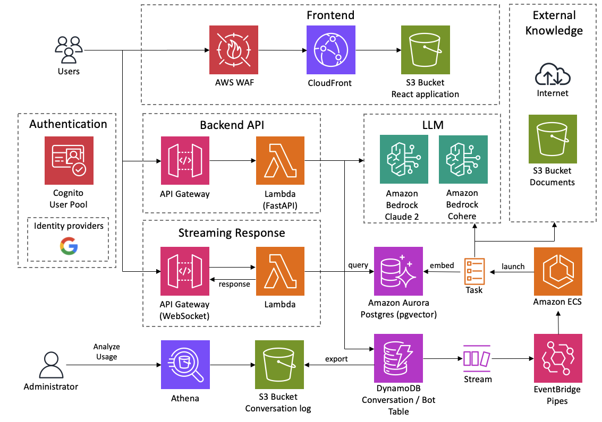

# Bedrock Claude Chat


> [!Caution]
> The `main` branch is no longer maintained and is equivalent to the `v0` version. Please consider migrating to the latest [`v1`](https://github.com/aws-samples/bedrock-claude-chat/tree/v1) branch which is now the default branch.

This repository is a sample chatbot using the Anthropic company's LLM [Claude](https://www.anthropic.com/), one of the foundational models provided by [Amazon Bedrock](https://aws.amazon.com/bedrock/) for generative AI.

### Basic Conversation

Not only text but also images are available with [Anthropic's Claude 3](https://www.anthropic.com/news/claude-3-family). Currently we support `Haiku`, `Sonnet` and `Opus`.


### Bot Personalization

Add your own instruction and give external knowledge as URL or files (a.k.a [RAG](./docs/RAG.md)). The bot can be shared among application users. The customized bot also can be published as stand-alone API (See the [detail](./docs/PUBLISH_API.md)).


### Administrator dashboard

Analyze usage for each user / bot on administrator dashboard. [detail](./docs/ADMINISTRATOR.md)


## 📚 Supported Languages

- English 💬
- 日本語 💬 (ドキュメントは[こちら](./docs/README_ja.md))
- 한국어 💬
- 中文 💬
- Français 💬
- Deutsch 💬
- Español 💬
- Italian 💬

## 🚀 Super-easy Deployment

- In the us-east-1 region, open [Bedrock Model access](https://us-east-1.console.aws.amazon.com/bedrock/home?region=us-east-1#/modelaccess) > `Manage model access` > Check `Anthropic / Claude 3 Haiku`, `Anthropic / Claude 3 Sonnet` and `Cohere / Embed Multilingual` then `Save changes`.

<details>
<summary>Screenshot</summary>


</details>

- Open [CloudShell](https://console.aws.amazon.com/cloudshell/home) at the region where you want to deploy
- Run deployment via following commands

```sh
git clone https://github.com/aws-samples/bedrock-claude-chat.git
cd bedrock-claude-chat
chmod +x bin.sh
./bin.sh
```

### Optional Parameters

You can now specify the following parameters during deployment to enhance security and customization:

- **--disable-self-register**: Disable self-registration (default: enabled). If this flag is set, you will need to create all users on cognito and it will not allow users to self register their accounts.
- **--ipv4-ranges**: Comma-separated list of allowed IPv4 ranges. (default: allow all ipv4 addresses)
- **--ipv6-ranges**: Comma-separated list of allowed IPv6 ranges. (default: allow all ipv6 addresses)
- **--allowed-signup-email-domains**: Comma-separated list of allowed email domains for sign-up. (default: no domain restriction)
- **--region**: Define the region where bedrock is available. (default: us-east-1)

#### Example command with parameters:

```sh
./bin.sh --disable-self-register --ipv4-ranges "192.0.2.0/25,192.0.2.128/25" --ipv6-ranges "2001:db8:1:2::/64,2001:db8:1:3::/64" --allowed-signup-email-domains "example.com,anotherexample.com" --region "us-west-2"
```

- After about 35 minutes, you will get the following output, which you can access from your browser

```
Frontend URL: https://xxxxxxxxx.cloudfront.net
```


The sign-up screen will appear as shown above, where you can register your email and log in.

> [!Important]
> This deployment method allows anyone with the URL to sign up if optional parameters are not configured. For production use, we strongly recommend adding IP address restrictions and disabling self-signup to mitigate security risks (Defining the `allowed-signup-email-domains` to allow only your emails from your comapny domain to be able to sing-up to restrict the users). For ip address restriction use both `ipv4-ranges` and `ipv6-ranges` and to disable self-signup use `disable-self-register` when executing `./bin`.

## Architecture

It's an architecture built on AWS managed services, eliminating the need for infrastructure management. Utilizing Amazon Bedrock, there's no need to communicate with APIs outside of AWS. This enables deploying scalable, reliable, and secure applications.

- [Amazon DynamoDB](https://aws.amazon.com/dynamodb/): NoSQL database for conversation history storage
- [Amazon API Gateway](https://aws.amazon.com/api-gateway/) + [AWS Lambda](https://aws.amazon.com/lambda/): Backend API endpoint ([AWS Lambda Web Adapter](https://github.com/awslabs/aws-lambda-web-adapter), [FastAPI](https://fastapi.tiangolo.com/))
- [Amazon CloudFront](https://aws.amazon.com/cloudfront/) + [S3](https://aws.amazon.com/s3/): Frontend application delivery ([React](https://react.dev/), [Tailwind CSS](https://tailwindcss.com/))
- [AWS WAF](https://aws.amazon.com/waf/): IP address restriction
- [Amazon Cognito](https://aws.amazon.com/cognito/): User authentication
- [Amazon Bedrock](https://aws.amazon.com/bedrock/): Managed service to utilize foundational models via APIs. Claude is used for chat response and Cohere for vector embedding
- [Amazon EventBridge Pipes](https://aws.amazon.com/eventbridge/pipes/): Receiving event from DynamoDB stream and launching ECS task to embed external knowledge
- [Amazon Elastic Container Service](https://aws.amazon.com/ecs/): Run crawling, parsing and embedding tasks. [Cohere Multilingual](https://txt.cohere.com/multilingual/) is the model used for embedding.
- [Amazon Aurora PostgreSQL](https://aws.amazon.com/rds/aurora/): Scalable vector store with [pgvector](https://github.com/pgvector/pgvector) plugin
- [Amazon Athena](https://aws.amazon.com/athena/): Query service to analyze S3 bucket



## Deploy using CDK

Super-easy Deployment uses [AWS CodeBuild](https://aws.amazon.com/codebuild/) to perform deployment by CDK internally. This section describes the procedure for deploying directly with CDK.

- Please have UNIX, Docker and a Node.js runtime environment. If not, you can also use [Cloud9](https://github.com/aws-samples/cloud9-setup-for-prototyping)

> [!Important]
> If there is insufficient storage space in the local environment during deployment, CDK bootstrapping may result in an error. If you are running in Cloud9 etc., we recommend expanding the volume size of the instance before deploying.

- Clone this repository

```
git clone https://github.com/aws-samples/bedrock-claude-chat
```

- Install npm packages

```
cd bedrock-claude-chat
cd cdk
npm ci
```

- Install [AWS CDK](https://aws.amazon.com/cdk/)

```
npm i -g aws-cdk
```

- Before deploying the CDK, you will need to work with Bootstrap once for the region you are deploying to. In this example, we will deploy to the us-east-1 region. Please replace your account id into `<account id>`.

```
cdk bootstrap aws://<account id>/us-east-1
```

- If necessary, edit the following entries in [cdk.json](./cdk/cdk.json) if necessary.

  - `bedrockRegion`: Region where Bedrock is available. **NOTE: Bedrock does NOT support all regions for now.**
  - `allowedIpV4AddressRanges`, `allowedIpV6AddressRanges`: Allowed IP Address range.

- Deploy this sample project

```
cdk deploy --require-approval never --all
```

- You will get output similar to the following. The URL of the web app will be output in `BedrockChatStack.FrontendURL`, so please access it from your browser.

```sh
 ✅  BedrockChatStack

✨  Deployment time: 78.57s

Outputs:
BedrockChatStack.AuthUserPoolClientIdXXXXX = xxxxxxx
BedrockChatStack.AuthUserPoolIdXXXXXX = ap-northeast-1_XXXX
BedrockChatStack.BackendApiBackendApiUrlXXXXX = https://xxxxx.execute-api.ap-northeast-1.amazonaws.com
BedrockChatStack.FrontendURL = https://xxxxx.cloudfront.net
```

## Others

### Configure Mistral models support

Update `enableMistral` to `true` in [cdk.json](./cdk/cdk.json), and run `cdk deploy`.

```json
...
  "enableMistral": true,
```

> [!Important]
> This project focus on Anthropic Claude models, the Mistral models are limited supported. For example, prompt examples are based on Claude models. This is a Mistral-only option, once you toggled to enable Mistral models, you can only use Mistral models for all the chat features, NOT both Claude and Mistral models.

### Configure default text generation

Users can adjust the [text generation parameters](https://docs.anthropic.com/claude/reference/complete_post) from the custom bot creation screen. If the bot is not used, the default parameters set in [config.py](./backend/app/config.py) will be used.

```py
DEFAULT_GENERATION_CONFIG = {
    "max_tokens": 2000,
    "top_k": 250,
    "top_p": 0.999,
    "temperature": 0.6,
    "stop_sequences": ["Human: ", "Assistant: "],
}
```

### Remove resources

If using cli and CDK, please `cdk destroy`. If not, access [CloudFormation](https://console.aws.amazon.com/cloudformation/home) and then delete `BedrockChatStack` and `FrontendWafStack` manually. Please note that `FrontendWafStack` is in `us-east-1` region.

### Stopping Vector DB for RAG

By setting [cdk.json](./cdk/cdk.json) in the following CRON format, you can stop and restart Aurora Serverless resources created by the [VectorStore construct](./cdk/lib/constructs/vectorstore.ts). Applying this setting can reduce operating costs. By default, Aurora Serverless is always running. Note that it will be executed in UTC time.

```json
...
"rdbSchedules": {
  "stop": {
    "minute": "50",
    "hour": "10",
    "day": "*",
    "month": "*",
    "year": "*"
  },
  "start": {
    "minute": "40",
    "hour": "2",
    "day": "*",
    "month": "*",
    "year": "*"
  }
}
```

### Language Settings

This asset automatically detects the language using [i18next-browser-languageDetector](https://github.com/i18next/i18next-browser-languageDetector). You can switch languages from the application menu. Alternatively, you can use Query String to set the language as shown below.

> `https://example.com?lng=ja`

### Disable self sign up

This sample has self sign up enabled by default. To disable self sign up, open [cdk.json](./cdk/cdk.json) and switch `selfSignUpEnabled` as `false`. If you configure [external identity provider](#external-identity-provider), the value will be ignored and automatically disabled.

### Restrict Domains for Sign-Up Email Addresses

By default, this sample does not restrict the domains for sign-up email addresses. To allow sign-ups only from specific domains, open `cdk.json` and specify the domains as a list in `allowedSignUpEmailDomains`.

```ts
"allowedSignUpEmailDomains": ["example.com"],
```

### External Identity Provider

This sample supports external identity provider. Currently we support [Google](./docs/idp/SET_UP_GOOGLE.md) and [custom OIDC provider](./docs/idp/SET_UP_CUSTOM_OIDC.md).

### Local Development

See [LOCAL DEVELOPMENT](./docs/LOCAL_DEVELOPMENT.md).

### Contribution

Thank you for considering contributing to this repository! We welcome bug fixes, language translations (i18n), feature enhancements, and other improvements.

For feature enhancements and other improvements, **before creating a Pull Request, we would greatly appreciate it if you could create a Feature Request Issue to discuss the implementation approach and details. For bug fixes and language translations (i18n), proceed with creating a Pull Request directly.**

Please also take a look at the following guidelines before contributing:

- [Local Development](./docs/LOCAL_DEVELOPMENT.md)
- [CONTRIBUTING](./CONTRIBUTING.md)

### RAG (Retrieval Augmented Generation)

See [here](./docs/RAG.md).

## Authors

- [Takehiro Suzuki](https://github.com/statefb)
- [Yusuke Wada](https://github.com/wadabee)
- [Yukinobu Mine](https://github.com/Yukinobu-Mine)

## Contributors

[](https://github.com/aws-samples/bedrock-claude-chat/graphs/contributors)

## License

This library is licensed under the MIT-0 License. See [the LICENSE file](./LICENSE).
