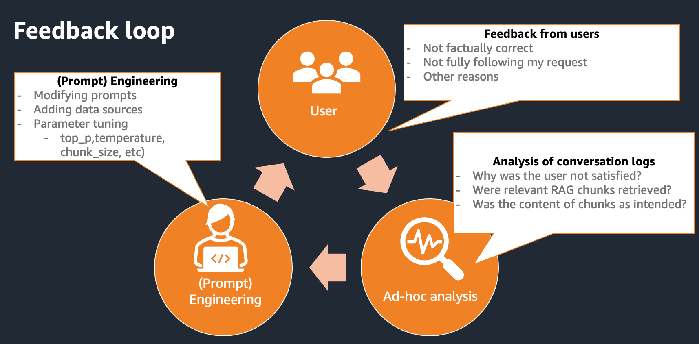
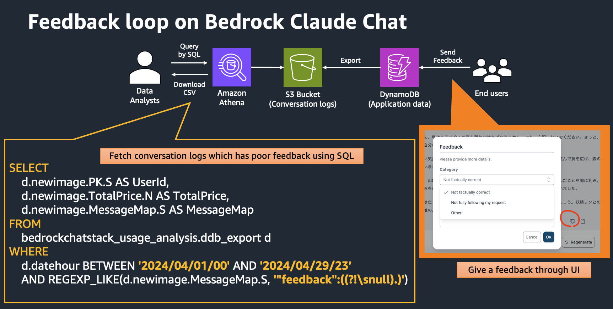
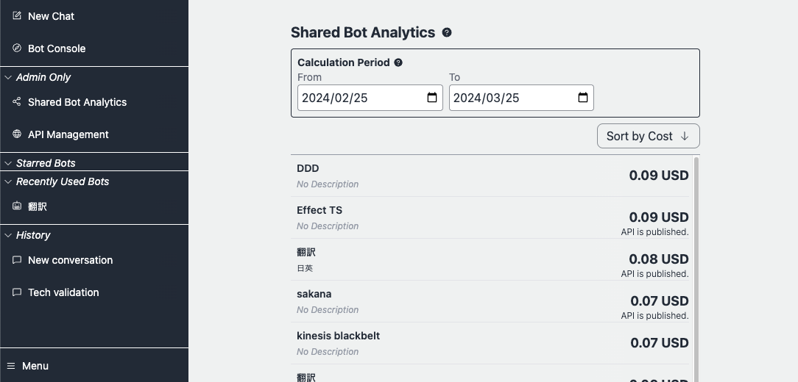
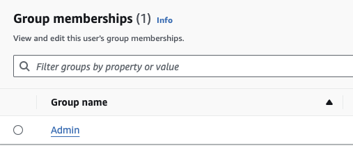

# Administrator features

The administrator features are a vital tool as it provides essential insights into custom bot usage and user behavior. Without the functionality, it would be challenging for administrators to understand which custom bots are popular, why they are popular, and who is using them. This information is crucial for optimizing instruction prompts, customizing RAG data sources, and identifying heavy users who might will be an influencer.

## Feedback loop

The output from LLM may not always meet the user's expectations. Sometimes it fails to satisfy the user's needs. To effectively "integrate" LLMs into business operations and daily life, implementing a feedback loop is essential. Bedrock Claude Chat is equipped with a feedback feature designed to enable users to analyze why dissatisfaction arose. Based on the analysis results, users can adjust the prompts, RAG data sources, and parameters accordingly.





Data analysts can access to conversation logs using [Amazon Athena](https://aws.amazon.com/jp/athena/). If they want to analyze the data by [Jupyter Notebook](https://jupyter.org/), [this notebook example](./notebooks/feedback_analysis_example.ipynb) can be a reference.

## Administrator dashboard

Currently provides a basic overview of chatbot and user usage, focusing on aggregating data for each bot and user over specified time periods and sorting the results by usage fees.



> [!Note]
> User usage analytics is coming soon.

### Prerequisites

The admin user must be a member of group called `Admin`, which can be set up via the management console > Amazon Cognito User pools or aws cli. Note that the user pool id can be referred by accessing CloudFormation > BedrockChatStack > Outputs > `AuthUserPoolIdxxxx`.



## Notes

- As stated in the [architecture](../README.md#architecture), the admin features will refer to the S3 bucket exported from DynamoDB. Please note that since the export is performed once every hour, the latest conversations may not be reflected immediately.

- In public bot usages, bots that have not been used at all during the specified period will not be listed.

- In user usages, users who have not used the system at all during the specified period will not be listed.

## Download conversation data

You can query the conversation logs by Athena, using SQL. To download logs, open Athena Query Editor from management console and run SQL. Followings are some example queries which are useful to analyze use-cases. Feedback can be referred in `MessageMap` attribute.

### Query per Bot ID

Edit `bot-id` and `datehour`. `bot-id` can be referred on Bot Management screen, where can be accessed from Bot Publish APIs, showing on the left sidebar. Note the end part of the URL like `https://xxxx.cloudfront.net/admin/bot/<bot-id>`.

```sql
SELECT
    d.newimage.PK.S AS UserId,
    d.newimage.SK.S AS ConversationId,
    d.newimage.MessageMap.S AS MessageMap,
    d.newimage.TotalPrice.N AS TotalPrice,
    d.newimage.CreateTime.N AS CreateTime,
    d.newimage.LastMessageId.S AS LastMessageId,
    d.newimage.BotId.S AS BotId,
    d.datehour AS DateHour
FROM
    bedrockchatstack_usage_analysis.ddb_export d
WHERE
    d.newimage.BotId.S = '<bot-id>'
    AND d.datehour BETWEEN '<yyyy/mm/dd/hh>' AND '<yyyy/mm/dd/hh>'
    AND d.Keys.SK.S LIKE CONCAT(d.Keys.PK.S, '#CONV#%')
ORDER BY
    d.datehour DESC;
```

### Query per User ID

Edit `user-id` and `datehour`. `user-id` can be referred on Bot Management screen.

> [!Note]
> User usage analytics is coming soon.

```sql
SELECT
    d.newimage.PK.S AS UserId,
    d.newimage.SK.S AS ConversationId,
    d.newimage.MessageMap.S AS MessageMap,
    d.newimage.TotalPrice.N AS TotalPrice,
    d.newimage.CreateTime.N AS CreateTime,
    d.newimage.LastMessageId.S AS LastMessageId,
    d.newimage.BotId.S AS BotId,
    d.datehour AS DateHour
FROM
    bedrockchatstack_usage_analysis.ddb_export d
WHERE
    d.newimage.PK.S = '<user-id>'
    AND d.datehour BETWEEN '<yyyy/mm/dd/hh>' AND '<yyyy/mm/dd/hh>'
    AND d.Keys.SK.S LIKE CONCAT(d.Keys.PK.S, '#CONV#%')
ORDER BY
    d.datehour DESC;
```
