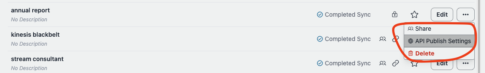
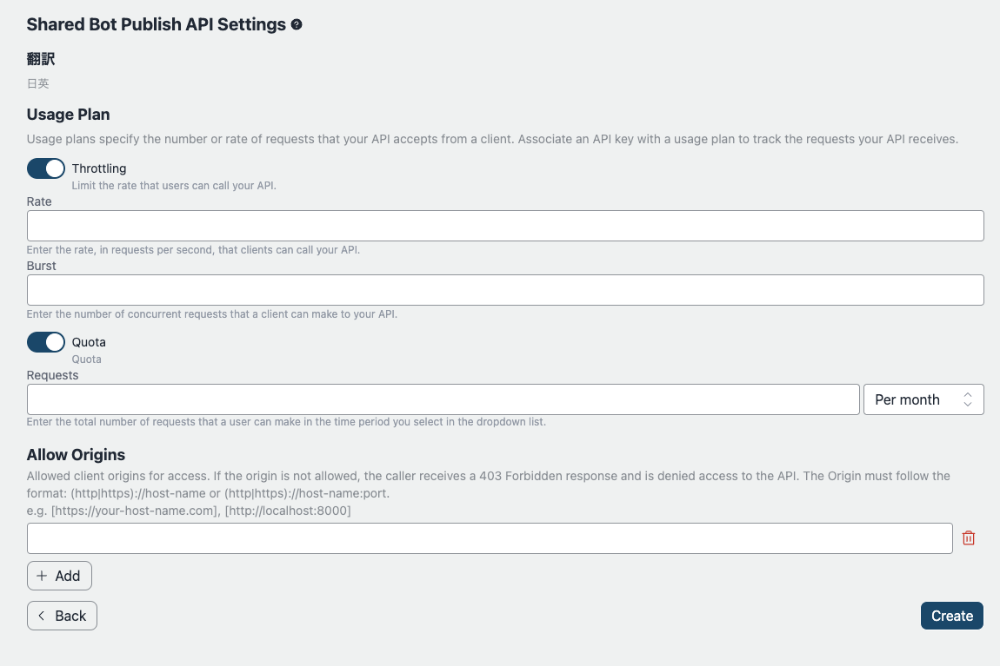
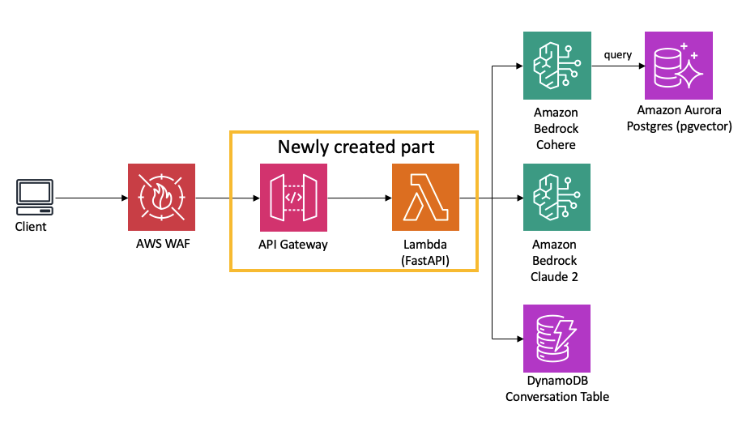

# API Publication

## Overview

This sample includes a feature for publishing APIs. While a chat interface can be convenient for preliminary validation, the actual implementation depends on the specific use case and user experience (UX) desired for the end-user. In some scenarios, a chat UI may be the preferred choice, while in others, stand-alone API might be more suitable. After initial validation, this sample provides the capability to publish customized bots according to the project's needs. By entering settings for quotas, throttling, origins, etc., an endpoint can be published along with an API key, offering flexibility for diverse integration options.

## Security

Using only an API key is not recommended as described in: [AWS API Gateway Developer Guide](https://docs.aws.amazon.com/apigateway/latest/developerguide/api-gateway-api-usage-plans.html). Consequently, this sample implements a simple IP address restriction via AWS WAF. The WAF rule is applied commonly across the application due to cost considerations, under the assumption that the sources one would want to restrict are likely the same across all issued APIs. **Please adhere to your organization's security policy for actual implementation.** Also see [Architecture](#architecture) section.

## How to publish customized bot API

### Prerequisites

For governance reasons, only limited users are able to publish bots. Before publishing, the user must be a member of group called `PublishAllowed`, which can be set up via the management console > Amazon Cognito User pools or aws cli. Note that the user pool id can be referred by accessing CloudFormation > BedrockChatStack > Outputs > `AuthUserPoolIdxxxx`.

### API Publish Settings

After logging in as a `PublishedAllowed` user and create a bot, choose `API PublishSettings`. Note that only a shared bot can be published.

On the following screen, we can configure several parameters regarding throttling. For the detail, please also see: [Throttle API requests for better throughput](https://docs.aws.amazon.com/apigateway/latest/developerguide/api-gateway-request-throttling.html).

After deployment, following screen will appear where you can get the endpoint url and a api key. We can also add and delete api keys.

## Architecture

The API is published as following diagram:

The WAF is used for ip address restriction. The address can be configured by setting parameters `publishedApiAllowedIpV4AddressRanges` and `publishedApiAllowedIpV6AddressRanges` in `cdk.json`.

Once a user click publish the bot, [AWS CodeBuild](https://aws.amazon.com/codebuild/) launch CDK deployment task to provision the API stack (Also see: [CDK definition](../cdk/lib/api-publishment-stack.ts)) which contains API Gateway, Lambda and SQS. SQS is used to decouple user request and LLM operation because generating output may exceed 30sec, which is the limit of API Gateway quota. To fetch the output, need to access the API asynchronously. For more the detail, see [API Specification](#api-specification).

Client needs to set `x-api-key` on the request header.

## API specification

See [here](https://aws-samples.github.io/bedrock-claude-chat).
