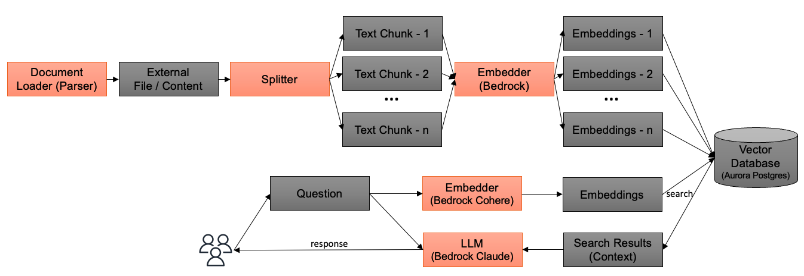

# RAG (Retrieval Augmented Generation)

In this example, we've implemented the RAG feature using [pgvector](https://github.com/pgvector/pgvector), a PostgreSQL extension that facilitates vector search. We've chosen to run pgvector on [Amazon Aurora Serverless v2](https://aws.amazon.com/rds/aurora/serverless/) due to its cost-effectiveness compared to alternatives like [OpenSearch](https://opensearch.org/) and [Amazon Kendra](https://aws.amazon.com/kendra/), especially when dealing with a smaller user base. This approach allows for a more budget-friendly start.

## RAG Logic

Please note that this example implements a simple logic as described in the following diagram:



When a bot is created or updated, the document loader retrieves documents from S3 and the internet, converting them into text. The splitter then divides these texts into several chunks for efficiency, based on the number of tokens. Bedrock (Cohere Multilingual) calculates embedding vector values and stores them in a database. When a user asks a question, the sentence is also converted into a vector using Bedrock (Cohere), and then pgvector retrieves similar chunks from the vector database. The question, along with the search results, is passed to Bedrock (Claude), which then generates responses for the user.

You can configure some parameters (See [Configure RAG Parameters](./CONFIGURE_KNOWLEDGE.md)). To customize the RAG logic, edit [embedding](../backend/embedding/) for ECS task and edit [vector_search.py](../backend/app/vector_search.py) for query handling.

## Dependencies

We utilize [Unstructured](https://github.com/Unstructured-IO) for parsing documents and [Llamaindex](https://www.llamaindex.ai/) for splitting them into chunks. [Playwright](https://playwright.dev/) is used to render content whose `Content-Type` corresponds to `text/html`.

## Note

As described in this [blog](https://www.timescale.com/blog/nearest-neighbor-indexes-what-are-ivfflat-indexes-in-pgvector-and-how-do-they-work/), the pgvector index should be updated as the data evolves. To rebuild the index, execute following sql:

```
REINDEX INDEX CONCURRENTLY idx_items_embedding;
```

Please be aware that this sample does not include the execution of the above re-indexing. We recommend to add periodical runner for production environment.

## RAG by Amazon Kendra

If interested in RAG using [Amazon Kendra](https://aws.amazon.com/kendra/), also refer following samples:

- [generative-ai-use-cases-jp](https://github.com/aws-samples/generative-ai-use-cases-jp) (In Japanese)
- [simple-lex-kendra-jp](https://github.com/aws-samples/simple-lex-kendra-jp) (In Japanese)
- [jp-rag-sample](https://github.com/aws-samples/jp-rag-sample) (In Japanese)
