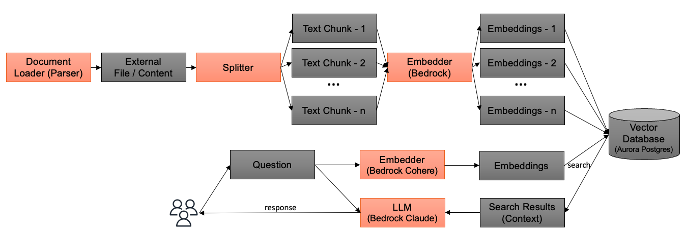

# RAG (Retrieval Augmented Generation, 検索拡張生成)

[RAG](https://aws.amazon.com/what-is/retrieval-augmented-generation/) (Retrieval Augmented Generation, 検索拡張生成) は、外部知識源を LLM にリンクすることで、より正確で詳細な回答生成を可能にする技術です。外部知識源を参照することで、LLM を単独で使用する際に発生しやすい誤った回答（ハルシネーション）の緩和が可能になります。

このサンプルでは、[pgvector](https://github.com/pgvector/pgvector) (PostgreSQL のベクトル検索を可能にする拡張機能) を使用して RAG 機能を実装しています。コスト効果の高さから、[OpenSearch](https://opensearch.org/)や[Amazon Kendra](https://aws.amazon.com/kendra/)といった代替手段と比較して、[Amazon Aurora Serverless v2](https://aws.amazon.com/rds/aurora/serverless/)上で pgvector を実行します。特にユーザー数が少ない段階では、このアプローチにより限られた予算内で始めることができます。

## RAG のロジック

このサンプルは、以下の図に示す単純なロジックを実装しています。

ボットが作成または更新されると、ドキュメントローダーが S3 やインターネットからドキュメントを取得し、テキストに変換します。次にスプリッターが、トークン数に基づいてテキストをいくつかのチャンクに分割します。Bedrock(Cohere Multilingual)は埋め込みベクトル値を計算し、それをデータベースに格納します。ユーザーが質問をすると、その文も Bedrock(Cohere)を使用してベクトル化され、pgvector がベクトルデータベースから類似のチャンクを検索します。質問と検索結果は Bedrock(Claude)に渡され、ユーザーへの応答が生成されます。

本サンプルでは、いくつかのパラメータを設定できます([Configure RAG Parameters](./CONFIGURE_KNOWLEDGE.md))。RAG ロジックをカスタマイズするには、ECS タスクの embedding を編集し、クエリ処理の [vector_search.py](../backend/app/vector_search.py) を編集してください。

> [!Note]
> 現在 RAG についてははマルチモーダルをサポートしていません。検索クエリには文章のテキストのみが使用されます (添付された画像は無視されます) 。

## 依存関係

ドキュメントの解析には[Unstructured](https://github.com/Unstructured-IO)を、ドキュメントのチャンク分割には[Llamaindex](https://www.llamaindex.ai/)を使用しています。`Content-Type`が`text/html`のコンテンツのレンダリングには[Playwright](https://playwright.dev/)を使用しています。

## Amazon Kendra による RAG

Amazon Kendra を使用した RAG に興味がある場合は、以下のサンプルも参照してください。

- [generative-ai-use-cases-jp](https://github.com/aws-samples/generative-ai-use-cases-jp) (In Japanese)
- [simple-lex-kendra-jp](https://github.com/aws-samples/simple-lex-kendra-jp) (In Japanese)
- [jp-rag-sample](https://github.com/aws-samples/jp-rag-sample) (In Japanese)
